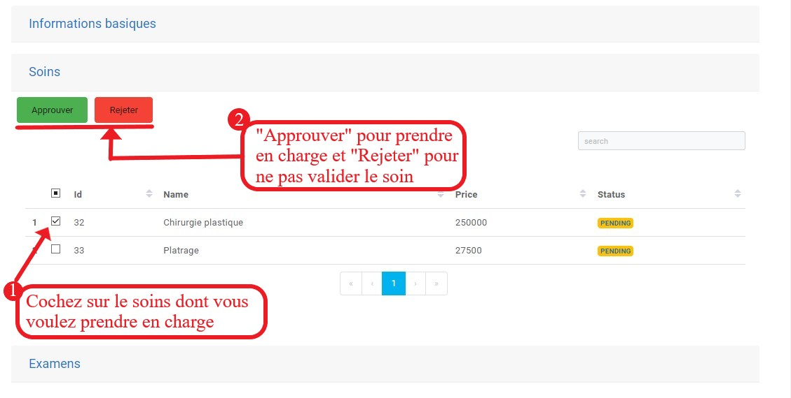

Contract Management
====================

Once logged into the application, you are redirected to the homepage, which directly displays the list of insurance contract data.

.. image:: ../Images/img-ass/contrat_acc.jpg
.. centered:: Insurance home page and contract list displayed in table format.

.. image:: ../Images/img-ass/fonc_prix.jpg
.. centered:: Display based on the insurance premium.

.. image:: ../Images/img-ass/diag.jpg
.. centered:: Display in graph format.

Registering a New Contract
------------------------------

After clicking on "New" to register a new insurance contract with a vehicle, a form will be presented where you need to enter certain information and then click "Save" to record the contract.

Insurance
^^^^^^^^^^^^

Here, you are asked to provide contract information.

.. image:: ../Images/img-ass/ass.jpg
.. centered:: Contract information.

Client
^^^^^^^^^^

At this stage, you need to provide information related to the client.

.. image:: ../Images/img-ass/inf_pat.jpg
.. centered:: Client information.

Vehicle Information
^^^^^^^^^^^^^^^^^^^^^^

At this stage, you need to provide information related to the vehicle.

.. image:: ../Images/img-ass/vehi.jpg
.. centered:: Vehicle information.

When the agent needs to enter the vehicle registration number, a list of vehicles that have undergone technical inspections will be proposed based on the entered registration characters.

.. centered:: License plate search.

Accident Management
======================

To view the list of accidents in their fleet, click on the "Accidents" tab in the menu bar.

.. centered:: Display in table format.

.. centered:: Display based on the severity of the accident.

.. image:: ../Images/img-ass/aff_diag.jpg
.. centered:: Display in graph format.

Consult the List of Injured Parties
---------------------------------------

Based on the vehicles involved in the accident, the claims agent who reported the accident should have also linked injured parties to the victim vehicles.

.. centered:: Consult medical records associated with various contracts.

After clicking on the icon for consulting the injured parties, you can view details about their medical file.

.. centered:: View the list of the patient’s examinations and treatments.

When you click on the icon to consult the medical file, you will be able to see information about the patient, the treatments and examinations that have been proposed, and then validate these treatments and examinations according to the contract with the vehicle.

.. image:: ../Images/img-ass/inf_pat.jpg
.. centered:: Patient information.

.. centered:: Approve or reject a treatment.

.. centered:: Approve or reject an examination.

When an examination or treatment is approved by the insurance, its status changes to "ACCEPTED".

.. centered:: Accepted status of examinations.

Consult the Accident Report
------------------------------

The insurance agent has the right to consult the accident report prepared by the claims agent.

Consult the Hospital Invoice
-------------------------------

To handle the costs of treatments and examinations, the insurance will have the option to consult the invoice to verify the treatments and examinations confirmed by their structure and make a payment to the hospital.
