Adding an Accident
===================

After entering your credentials, you will be redirected to the home page which looks as follows:

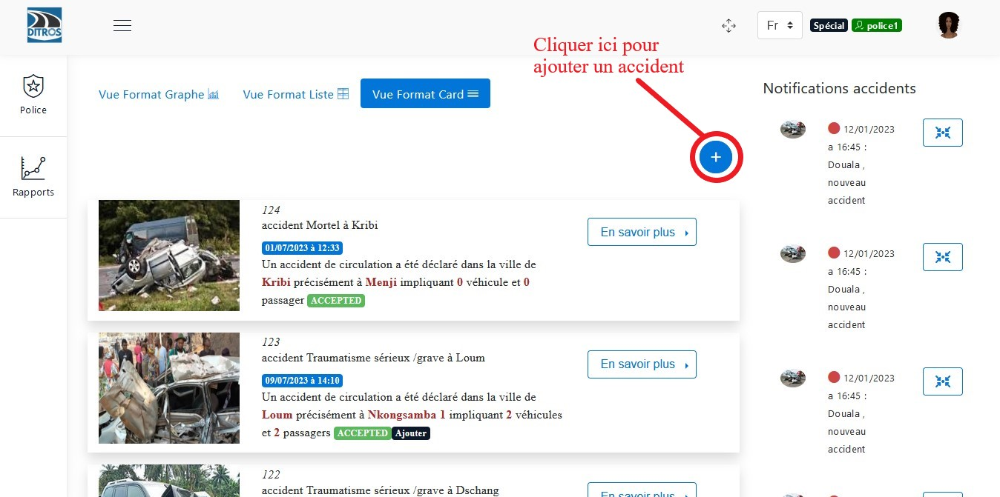
.. centered:: Police/Gendarmerie Home

After clicking on the icon to add an accident, several fields will be presented for you to enter information about the accident.

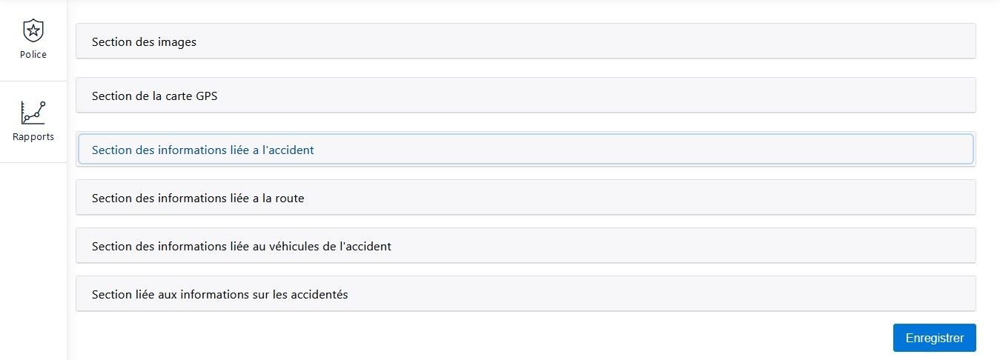
.. centered:: Adding an Accident

Adding an Image
-----------------

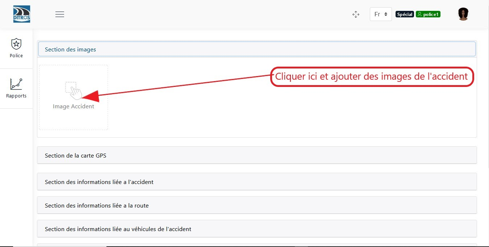
.. centered:: Adding Accident Image

Adding Accident Location
------------------------

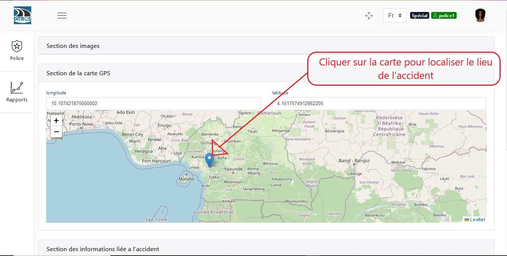
.. centered:: Adding Location

Section for Accident-Related Information
-----------------------------------------

When you click on this section, you only need to provide the information requested in the form.

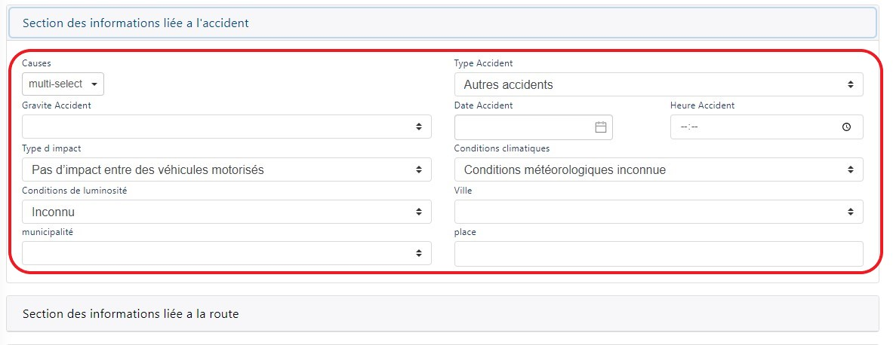
.. centered:: Adding Accident Information

Section for Road-Related Information
--------------------------------------

Enter the information requested in the form.

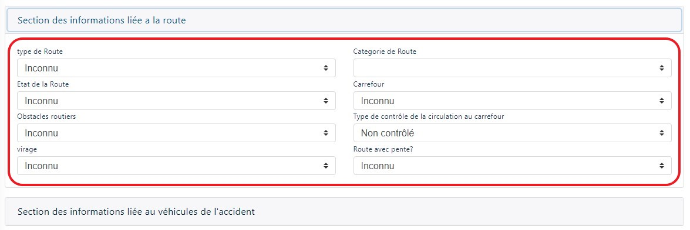
.. centered:: Adding Road Information

Section for Vehicle-Related Information
----------------------------------------

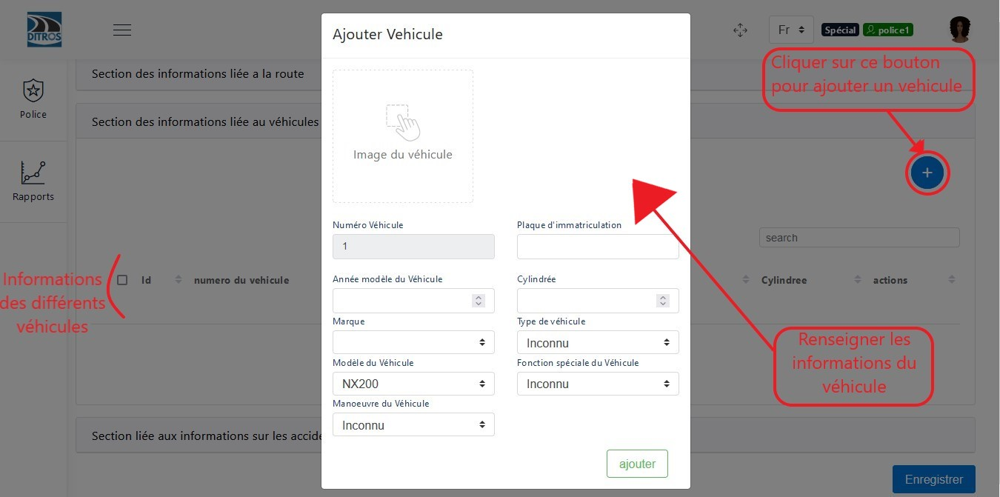
.. centered:: Adding Vehicle Information

Section for Accident Victim Information
----------------------------------------

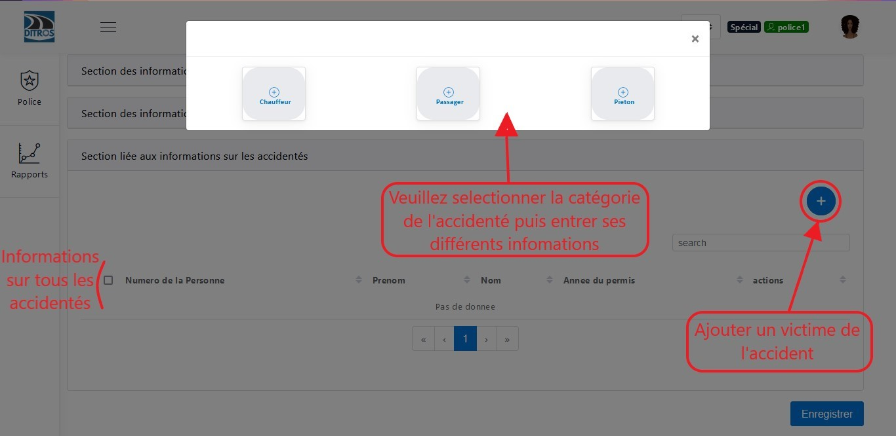
.. centered:: Adding Victim Information

After selecting the category of the victim, different dialog boxes will be presented:

For the Driver
~~~~~~~~~~~~~~

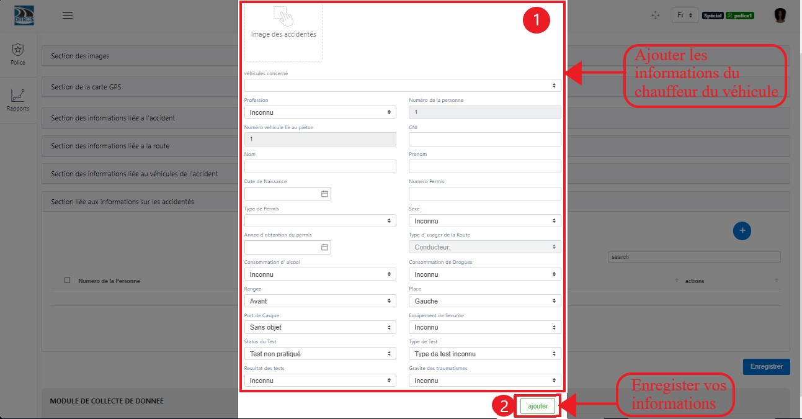
.. centered:: Adding a Driver Victim

For the Passenger
~~~~~~~~~~~~~~~~~

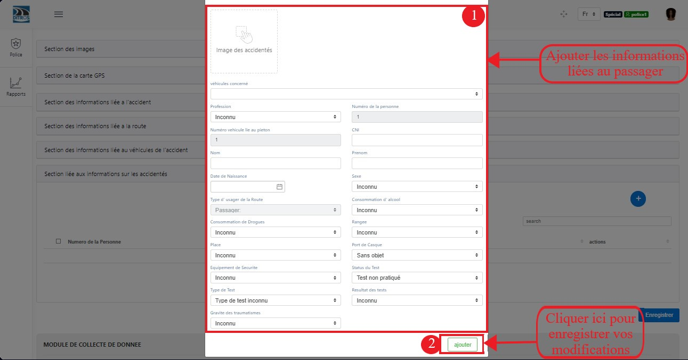
.. centered:: Adding a Passenger Victim

For the Pedestrian
~~~~~~~~~~~~~~~~~~

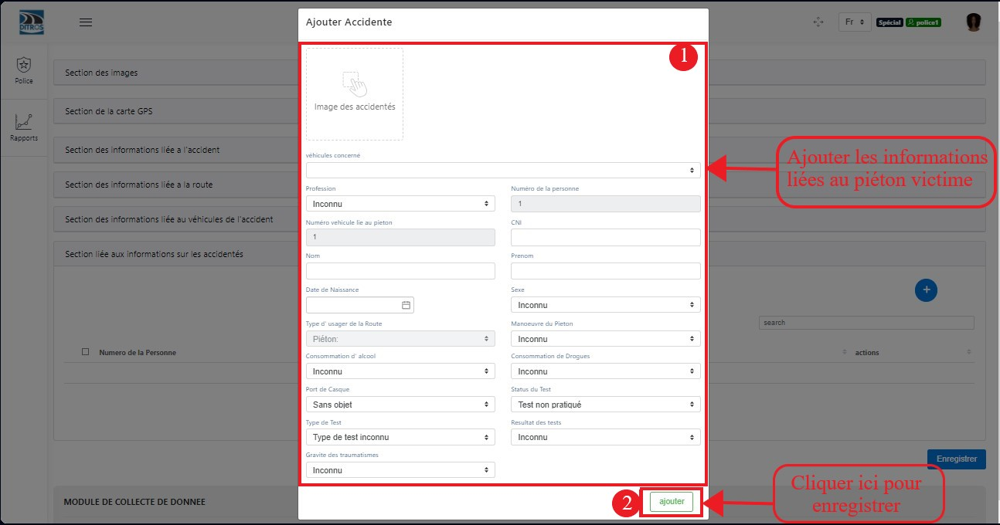
.. centered:: Adding a Pedestrian Victim

At the end of this procedure, please click the **“Save”** button to save the accident information as follows:

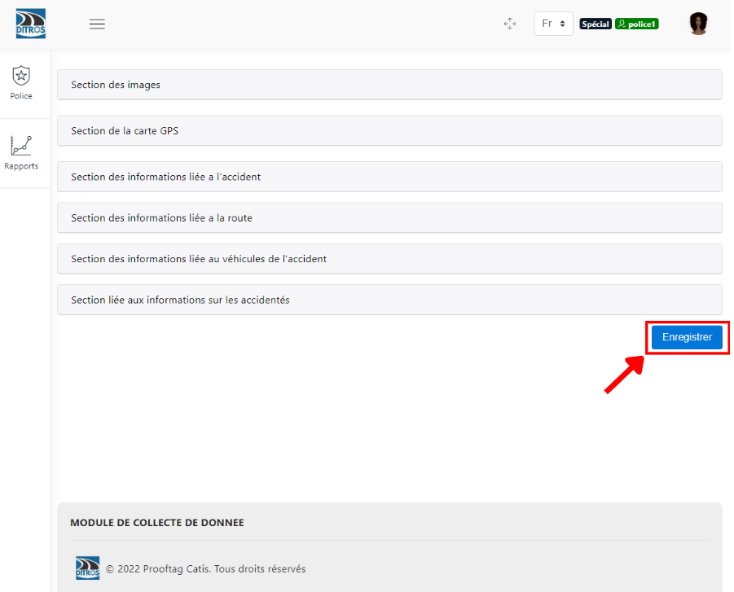
.. centered:: Save the Accident
