Adding an Accident Report
=========================

To add an accident report, there are two options:

* Click the **+** button on the page displaying the list of accident reports.
* Click on **the police module** in the right menu, then select **add an accident**.

The image below illustrates these two possibilities.

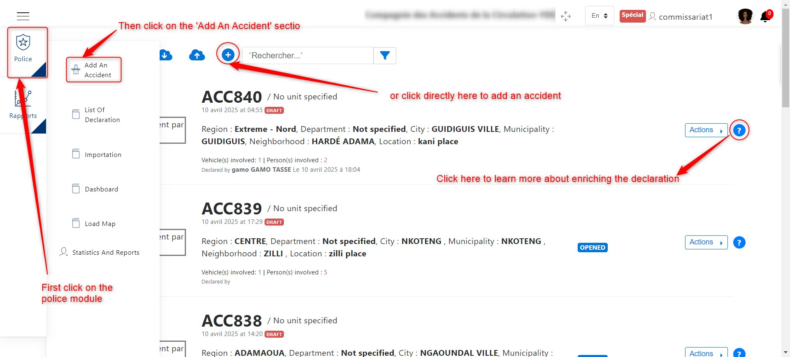
.. centered:: Police/Gendarmerie Home

After clicking on the add accident report icon, several steps will be presented 
to enter accident details. The information to be provided includes:

* :ref:`Inspector's information <refPoliceAgentConstatateur>`
* :ref:`Location details <refPoliceLocalisation>`
* :ref:`Accident information <refPoliceInfosAccident>`
* :ref:`Road information <refPoliceRoute>`
* :ref:`Involved vehicles <refPoliceVehiculesConsernes>`
* :ref:`Involved users <refPoliceUsagersConcernes>`
* :ref:`Sketch <refPoliceCroquis>`
* :ref:`A deposition <refPoliceDepositions>`

A detailed explanation of the accident report procedure follows:

.. _refPoliceAgentConstatateur:

Inspector
---------

This is the first section to fill out; it involves entering the 
identification details of the inspecting officer or officers if multiple agents 
are handling the report.

The interface for this step is shown below:

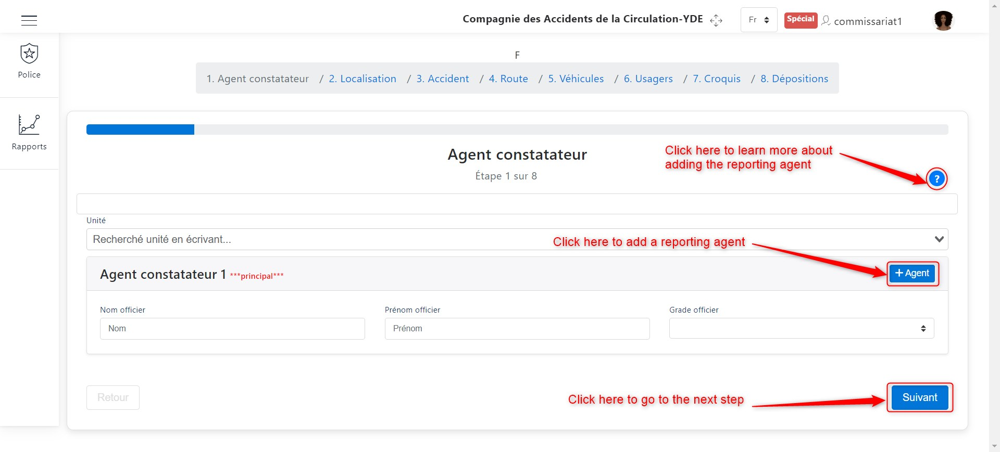
.. centered:: Inspector Information

As illustrated above, you can add multiple inspectors by clicking the **+ Agent** button.

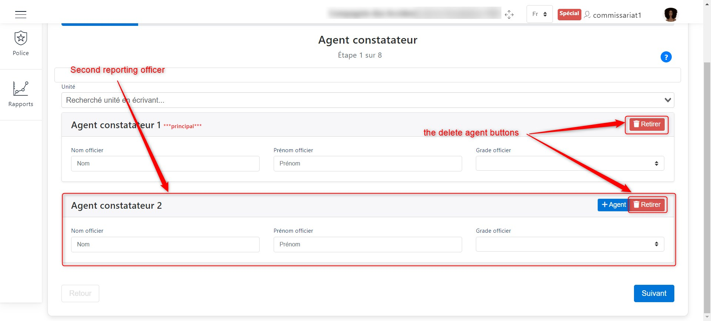
.. centered:: Second Inspector

Proceed to the next step by clicking the **Next** button.

.. _refPoliceLocalisation:

Location
--------

To enter the accident location, there are two methods:

**Method 1:** Enter location details manually

Manually input the following details:

* Region
* Department
* City
* Municipality
* Neighborhood
* Landmark
* Latitude
* Longitude

Then, click **Next** to complete this step and proceed.

**Method 2:** Select on the map

For those preferring to use the map, locate the accident zone, select the position, 
then click **Next** to proceed.

The image below illustrates both methods.

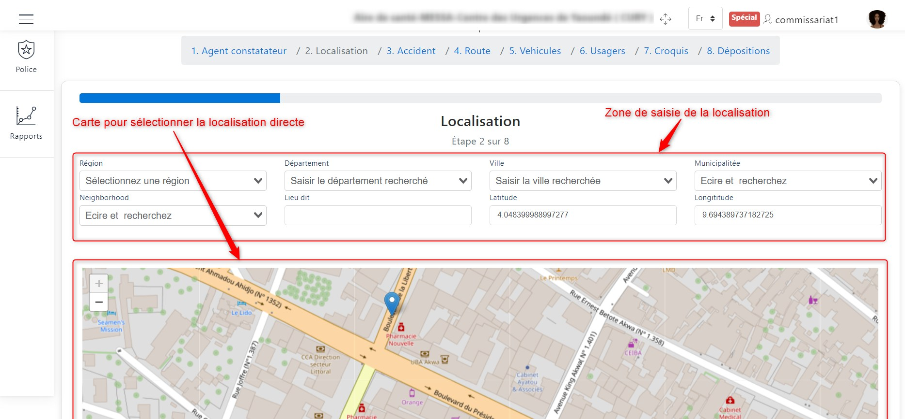
.. centered:: Location Information

Proceed to the next step by clicking **Next**.

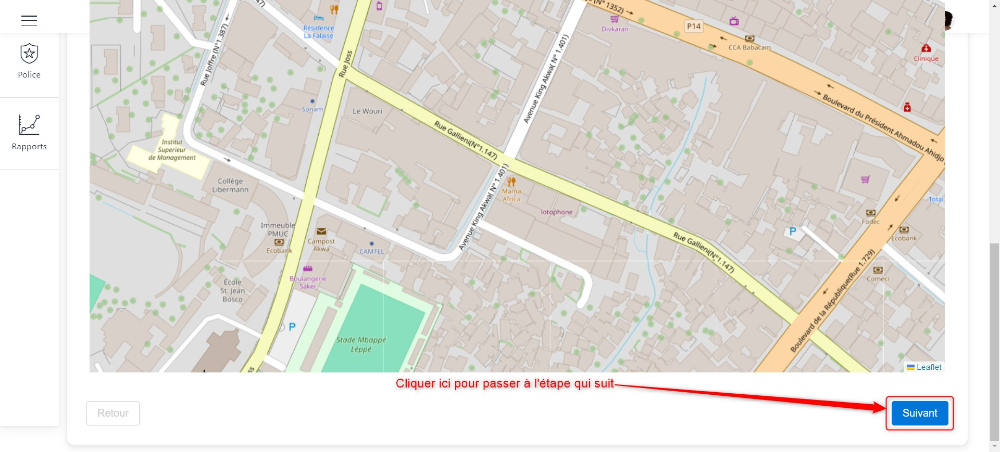
.. centered:: Next button

.. _refPoliceInfosAccident:

Accident  
--------

Now, it's time to add the accident details. Upload accident photos and 
fill in all required fields.

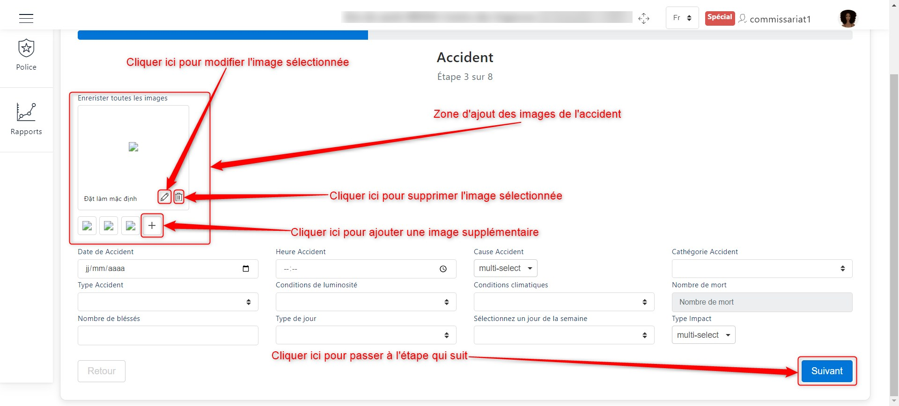
.. centered:: Accident Section

Proceed to the next step by clicking **Next**.

.. _refPoliceRoute:

Road  
----

At this stage, enter road-related details. Fill in the necessary fields to 
identify the road.

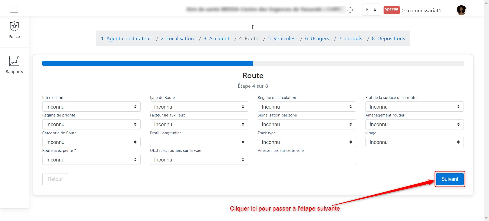
.. centered:: Road Information

Proceed to the next step by clicking **Next**.

.. _refPoliceVehiculesConsernes:

Involved Vehicles
-----------------

Here, you need to enter details about the vehicles involved in the accident.  
Click the **+** button, as shown in the image below, to add a vehicle.

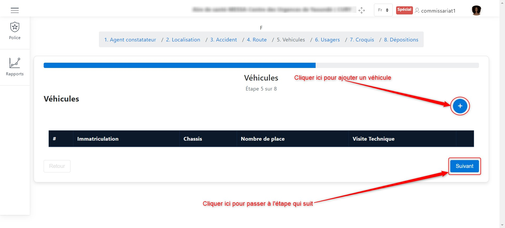
.. centered:: Enter details of involved vehicles

Once you click the **+** button, fill in the vehicle details as shown below.

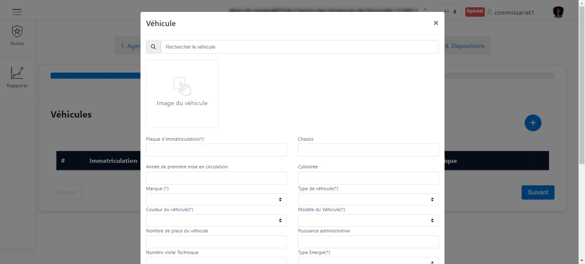
.. centered:: Enter vehicle details

After filling out the form, save the details as shown below.

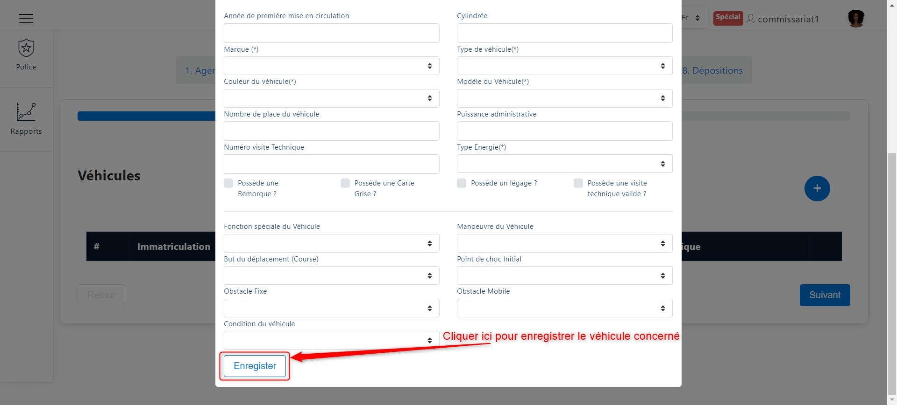
.. centered:: Save vehicle details

Once a vehicle is added, its summary appears in the table below.

.. image:: ../Images/img-police1&2/PoliceTableauInfosVehicule.jpg
.. centered:: Summary of involved vehicles

Proceed to the next step by clicking **Next**.

.. _refPoliceUsagersConcernes:

Involved Users
--------------

Here, you need to enter details about the users involved in the accident.  
Click the **+** button, as shown in the image below, to add a user.

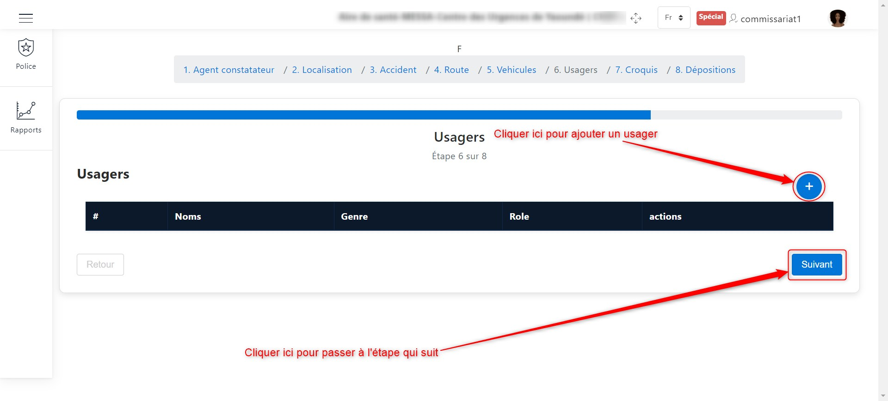
.. centered:: Enter details of involved users

Once you click the **+** button, fill in the user details as shown below.

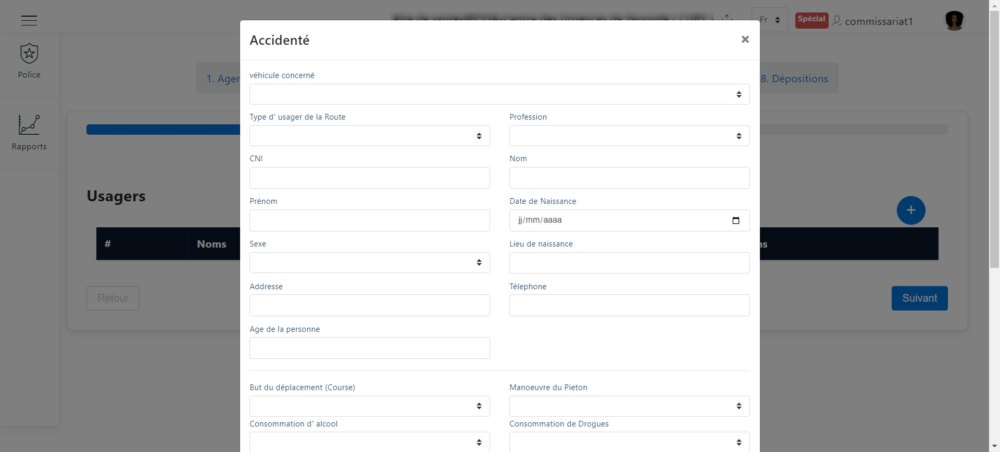
.. centered:: Enter user details

After filling out the form, save the details as shown below.

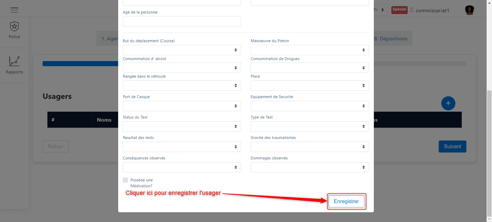
.. centered:: Save user details

Once a user is added, their summary appears in the table below.

.. image:: ../Images/img-police1&2/PoliceTableauInfosUsager.jpg
.. centered:: Summary of involved users

Proceed to the next step by clicking **Next**.

.. _refPoliceCroquis:

Sketch
------

To insert the accident sketch, two options are available:

* Draw the sketch directly within the application.
* Upload an image of the sketch.

The image below illustrates both methods.

.. _refPoliceInsererCroquis:

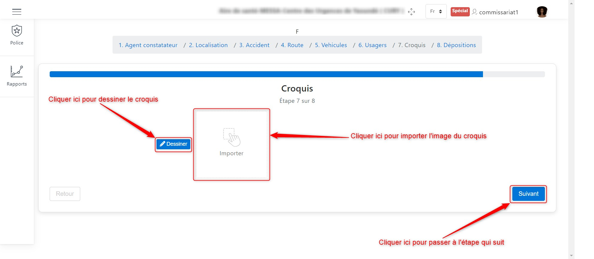
.. centered:: Insert a Sketch

**Method 1:** Draw within the application

To draw within the application, click the **Draw** button, as illustrated above.

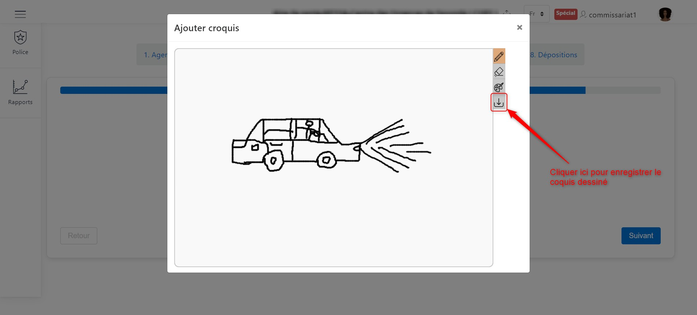
.. centered:: Drawing Area

Proceed to the next step by clicking **Next**, as indicated in 
:ref:`the following image <refPoliceInsererCroquis>`.

**Method 2:** Upload an image

To upload a sketch image, click the upload button, as shown in 
:ref:`the following image <refPoliceInsererCroquis>`. A window will appear to 
search for and import the sketch image.

.. image:: ../Images/img-police1&2/PoliceImporterCroquis.jpg
.. centered:: Upload sketch image

Proceed to the next step by clicking **Next**, as indicated in 
:ref:`the following image <refPoliceInsererCroquis>`.

.. _refPoliceDepositions:

Depositions
-----------

Upon reaching the deposition creation section, the interface below appears.  
Here, you can create a new deposition by clicking the **+** button, as shown in 
the image below. Additionally, you can enter observations on the right and 
remarks on the left.

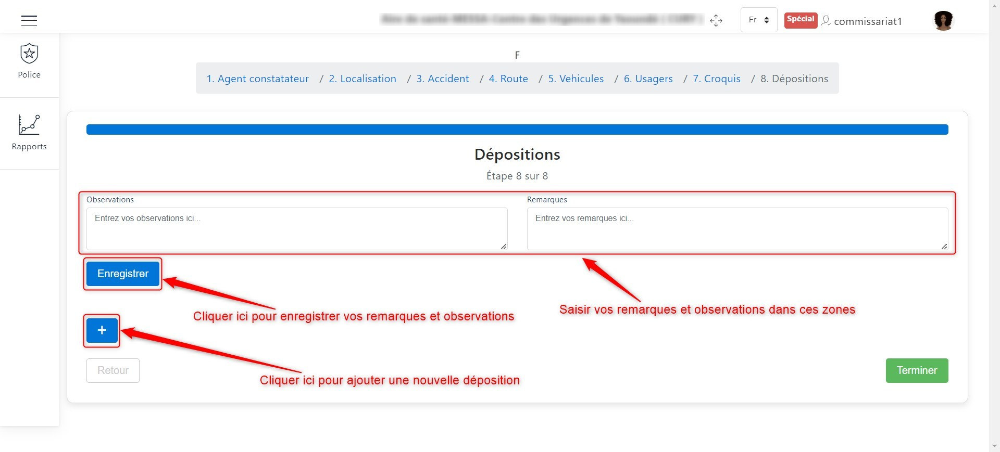
.. centered:: Create a Deposition

Clicking the **+** button brings up a window where you must enter 
the deponent’s information, the deposition date, and the questions asked 
along with their responses.

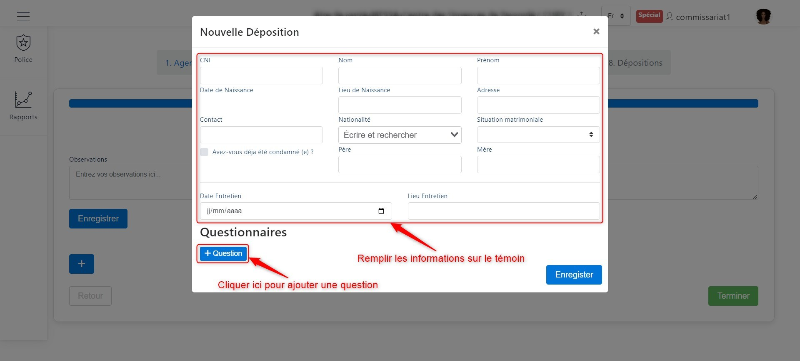
.. centered:: Enter deposition details

To add interview questions and responses, click **+ Question**. A section 
for filling in the details appears as follows. After completing all information,  
click **Save** to finalize the deposition.

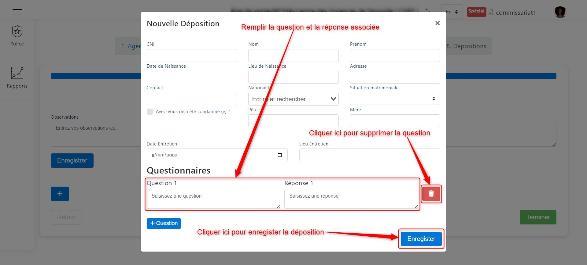
.. centered:: Add questions

Once a deposition is added, it appears as follows:

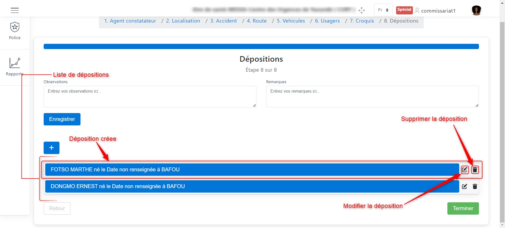
.. centered:: List of depositions

Clicking the witness's name in the deposition display allows you to view 
the entire interview.

Once all depositions have been entered, click **Finish** to save all depositions.

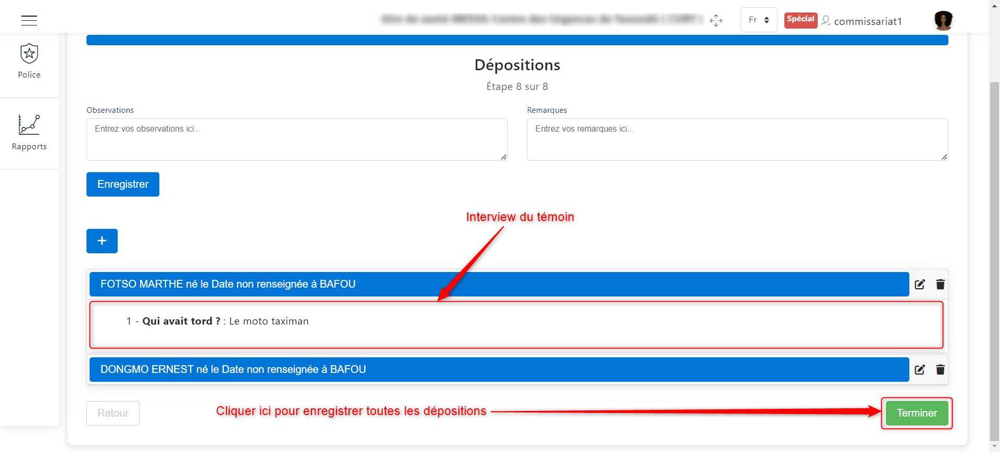
.. centered:: Witness interview
