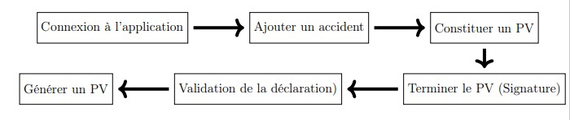
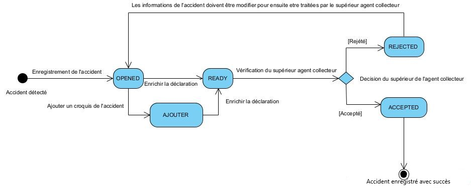

STATES AND DESCRIPTIONS
========================

This procedure includes two steps: reporting the accident and validating the accident. The primary actor in this procedure is a police or gendarme officer (Collector Agent).

The steps to follow are as follows:

It is also important to understand the different statuses that the vehicles recorded in the application will go through.

.. centered:: States Diagram of the Report

.. _knowStatus:
The different descriptions of these states are as follows:

.. list-table:: Descriptions of the States
   :widths: 20 30
   :header-rows: 1
   :class: tight-table

   * - States
     - Descriptions
   * - OPENED
     - When the accident has been detected and the reporting agent has entered the information they see to then draft a report of the accident. At this state, the agent can view or modify the information previously entered during the detection of the accident. For the continuation of the procedure, they will need to add the sketch, prepare the report, generate the report, and finally sign the report to complete it.
   * - READY
     - At this state, all the information related to the application has been added by the collector agent, and it is now the turn of the superior collector agent to validate or reject the information about the accident.
   * - REJECTED
     - Here, the superior collector agent has rejected the information related to the accident and has generated a reason for the rejection that the collector agent will take into account to modify the previously provided information.
   * - ACCEPTED
     - The superior collector agent has validated the accident information and confirmed it with their signature.
   * - Add
     - This is when the collector agent adds a sketch to their report, regardless of the report's status, before the report is validated by the superior collector agent.
