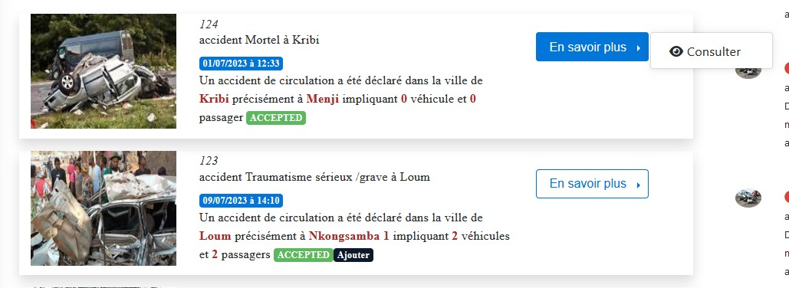

Enriching the Report
====================

After completing the accident reporting process, the status of the accident changes to “OPENED” and will be displayed in the list of reports.

.. centered:: List of Reports

Once you access the list of reports, you will see a list of reports from the most recent to the oldest. To complete the accident reporting process, click on “Learn More” for the accident you just added with the status “OPENED,” and you will see a list of tasks to be performed. :ref:`Click here to learn more about statuses. <knowStatus>`

.. centered:: Home

Modifying the Report
++++++++++++++++++++

By clicking on "Edit" to modify the report, you will be presented with a page similar to the accident addition page where you need to click on different tabs to modify according to your needs.

Modifying an Image
------------------

.. image:: ../Images/img-police1&2/modif_imag.jpg
    :name: Modifying Accident Images
.. centered:: Modifying Accident Images

GPS Data
--------

.. caution::
    When modifying the report, it is completely impossible to alter the accident location.

.. centered:: Viewing GPS Data

Accident Information
---------------------

Here, you only need to modify the section where you added incorrect information!

.. image:: ../Images/img-police1&2/acc_inf.jpg
    :name: Modifying Accident Information
.. centered:: Modifying Accident Information

Road Information
----------------

Modify here as needed.

.. image:: ../Images/img-police1&2/rout_inf.jpg
    :name: Modifying Road Information
.. centered:: Modifying Road Information

Vehicle Information
--------------------

A table of vehicles involved in the accident will be displayed, and you can delete a vehicle, modify vehicle information, or add vehicles.

.. image:: ../Images/img-police1&2/vehi_inf.jpg
    :name: Vehicle Information
.. centered:: Vehicle Information

After clicking on the vehicle modification icon, a dialog box will appear for you to modify the vehicle information as needed.

.. image:: ../Images/img-police1&2/vehi_modif.jpg
    :name: Modifying a Vehicle
.. centered:: Modifying a Vehicle

Injury Information
-------------------

A table of accident victims will be displayed, allowing you to delete a victim, modify victim information, or add victims.

.. centered:: List of Accident Victims

After clicking on the victim modification icon, a dialog box will appear for you to modify the victim information as needed.

.. image:: ../Images/img-police1&2/accidente_mod.jpg
    :name: Modifying Victim Information
.. centered:: Modifying Victim Information

Click on the **“Update”** button after modifying your report to save.

When saving information about the victims, you may link a victim to a vehicle so that later the insurance can cover the victims based on contracts with the vehicles. A list of previously entered vehicles will be presented to link a victim to a vehicle.

.. centered:: Selecting the Victim's Vehicle

When the collector agent adds a victim, they can link the victim to a hospital patient. As the agent enters the first characters of the victim's name, a list of patients will be suggested based on the entered characters, from which the agent can select.

.. image:: ../Images/img-police1&2/lie_acc.jpg
    :name: Associating a Victim with a Patient
.. centered:: Associating a Victim with a Patient

A dialog box will prompt you to enter the victim's name. Then click “Associate” to link the victim to the patient.

.. image:: ../Images/img-police1&2/boite_diag.jpg
    :name: Searching for a Patient
.. centered:: Searching for a Patient

Once the collector agent has associated a victim with a patient, they have the option to unassociate the two if they realize they made a mistake or linked the victim to the wrong patient.

.. centered:: Cancelling the Association

Adding a Sketch
++++++++++++++++

When you click “Add Sketch,” an interface will be presented where you need to create a sketch of the accident scene, either by importing it from your tablet or drawing it, and then save your action.

.. image:: ../Images/img-police1&2/import_dess.jpg
    :name: Choosing Sketch Insertion
.. centered:: Choosing Sketch Insertion

When you click on “Draw”:

.. image:: ../Images/img-police1&2/croq.jpg
    :name: Drawing a Sketch
.. centered:: Drawing a Sketch

Creating the Report
===================

For this task, you will be asked to enter certain information to link with the accident. After filling in this information, click “Save” to create the report.

.. centered:: Creating a Report

Completing the Report (Signing the Report)
==========================================

Here, you only need to provide your signature on the provided interface and then click **“Save”**.

.. image:: ../Images/img-police1&2/term.jpg
    :name: Signature
.. centered:: Signature

At the end of this task, the status of the accident changes to “READY,” and the subsequent part of the report will be handled by the senior collector agent.

Actions Performed by the Collector Agent Based on Report Statuses
=================================================================

Whether the status is “ACCEPTED” or “ACCEPTED Add,” the collector agent can only view the report again.

.. centered:: Collector Action at ACCEPTED Status

When the report status is “REJECTED” or “REJECTED Add,” the agent's actions will be to view the report, modify the report, modify the accident sketch, recreate the report, and sign the report at the end.

.. image:: ../Images/img-police1&2/rej_aj.jpg
    :name: Collector Action at REJECTED Status
.. centered:: Collector Action at REJECTED Status

When the agent adds an accident, the status of the accident changes to “OPENED,” but once they add the accident sketch, the status changes to “OPENED Add,” and the various actions they can perform are as follows, which have been detailed earlier in the document.

.. image:: ../Images/img-police1&2/open.jpg
    :name: Collector Action at OPENED Status
.. centered:: Collector Action at OPENED Status

When the collector agent completes the report, the report status changes to “READY,” and if the sketch has been added, it changes to “READY Add,” and the collector agent can only view the report.

.. centered:: Collector Action at READY Status
