Adding an Accident Report - MOBILE
===================================

After entering the identification key, which is only requested on the first launch, you are redirected to the home page, where you can add a new accident.

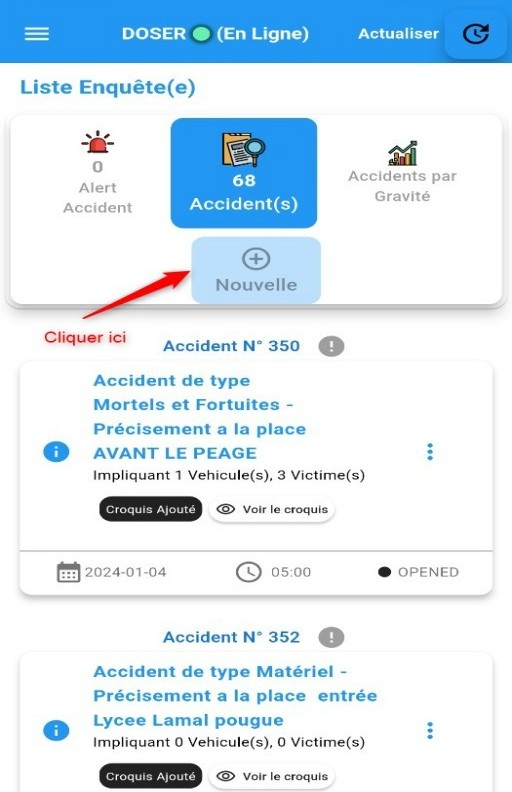
.. centered:: Home screen to add a new accident

After clicking on **+**, if you are offline, a warning message will be displayed asking if you want to continue, as shown in the following image:

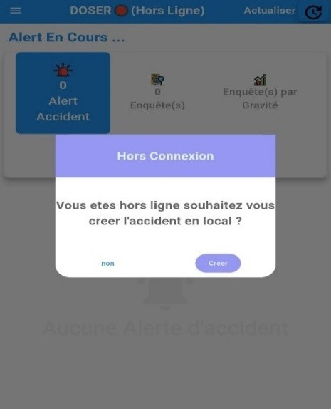

After clicking **Create**, several steps will be presented to enter the accident information.  
The information to be provided in these steps includes:

* :ref:`Inspector information <refPoliceAgentConstatateu>`
* :ref:`Location details <refPoliceLocalisatio>`
* :ref:`Accident details <refPoliceInfosAcciden>`
* :ref:`Road conditions <refPoliceRout>`
* :ref:`Involved vehicles <refPoliceVehiculesConserne>`
* :ref:`Involved users <refPoliceUsagersConcerne>`
* :ref:`Sketch <refPoliceCroqui>`
* :ref:`Statement <refPoliceDeposition>`

The detailed explanation of the accident declaration process is as follows:

.. _refPoliceAgentConstatateu:

Inspector
---------

Before adding an officer, you must first specify the organization they belong to, as shown in the following image:

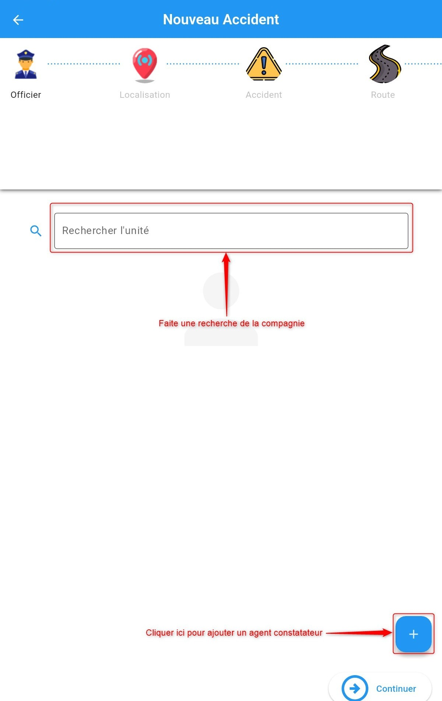
.. centered:: Search for the organization

Click on **+** as indicated in the previous image to add an inspector.

Fill in the fields in the displayed form.

If you are online, you can search for an existing police officer in the search field at the top of the form. Selecting an officer will automatically fill in the other fields, and you will only need to complete the missing information. Otherwise, fill in the form manually. If the name is not in the database, do the same.

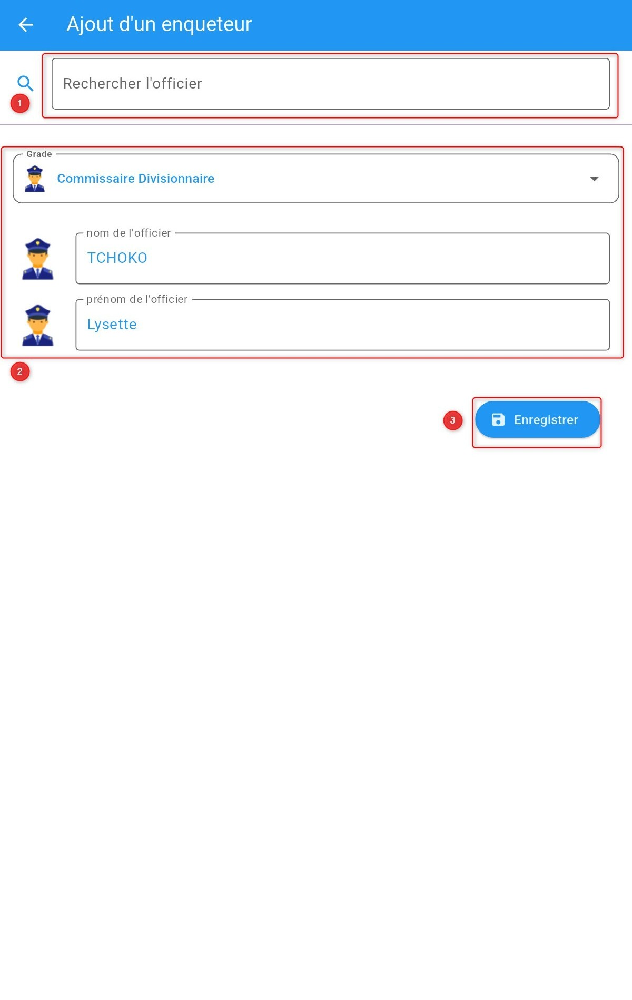
.. centered:: Adding investigator details

* **1.** Search for a pre-registered officer by name
* **2.** Manually fill in the fields
* **3.** Click **Save**

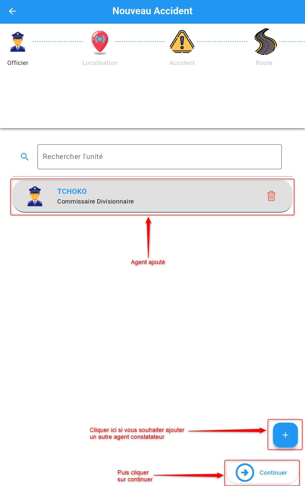
.. centered:: Investigator saved

Click **Continue** to complete this step and proceed to the next one.

.. _refPoliceLocalisatio:

Location
--------

To enter the accident location, there are two methods:

**Method 1:** Manually entering location information

You must enter the following details:

* Region  
* Department  
* City  
* Municipality  
* Neighborhood  
* Landmark  
* Latitude  
* Longitude  

Then, click **Continue** to proceed to the next step.

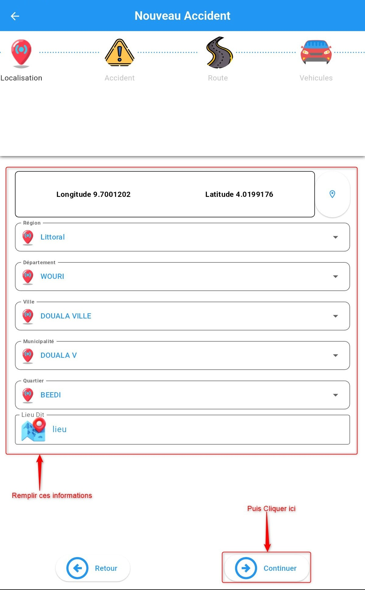
.. centered:: Location information

**Method 2:** Selecting the location on the map

For users who prefer using the map, locate the accident area on the map and select the position.

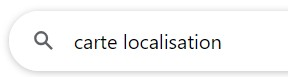
.. centered:: Location details

Click **Continue** to proceed to the next step.

.. _refPoliceInfosAcciden:

Accident  
--------

Fill in the form fields that appear.

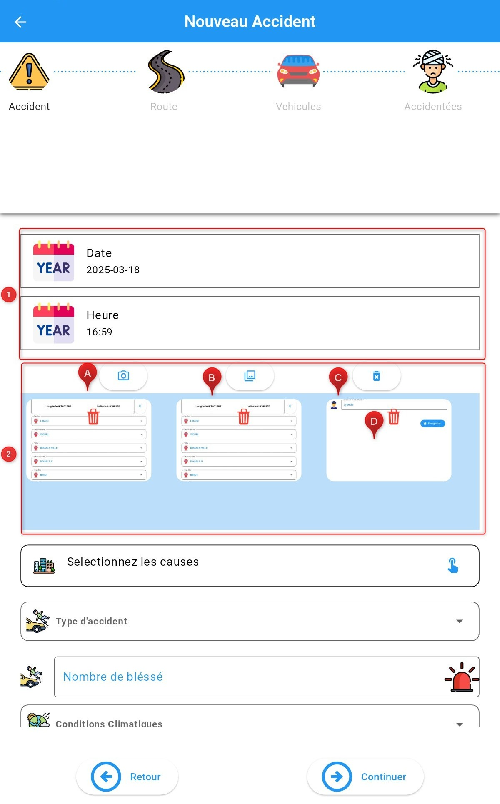
.. centered:: Accident section

* **1.** Enter the date and time  
* **2.** Add photos  

   * **A.** Take a photo  
   * **B.** Select a photo from the gallery  
   * **C.** Delete all captured or selected photos  
   * **D.** Delete a specific photo  

Then, complete the rest of the form fields:  
* By selecting options from the provided list  
* Or by manually entering text using the keyboard  

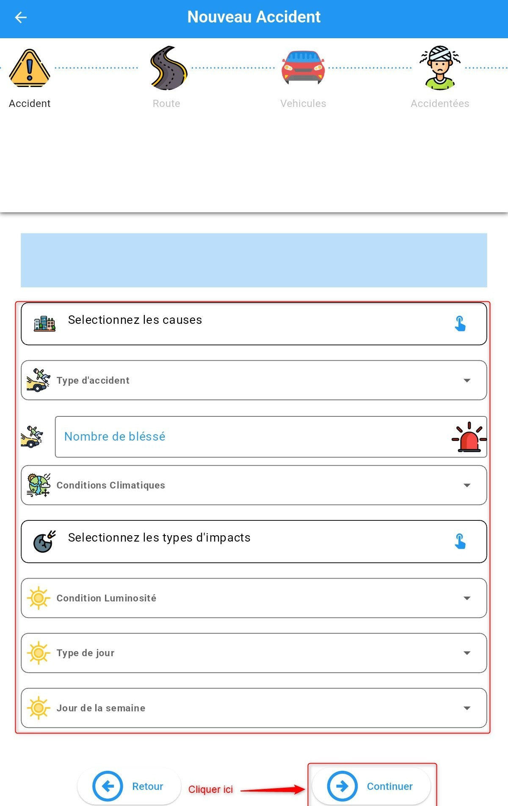
.. centered:: Accident section

Click **Continue** to proceed to the next step.

.. _refPoliceRout:

Road
----

At this step, you must provide information about the road.

Fill in the form fields:

* By selecting options from the provided list  
* Or by manually entering text using the keyboard  

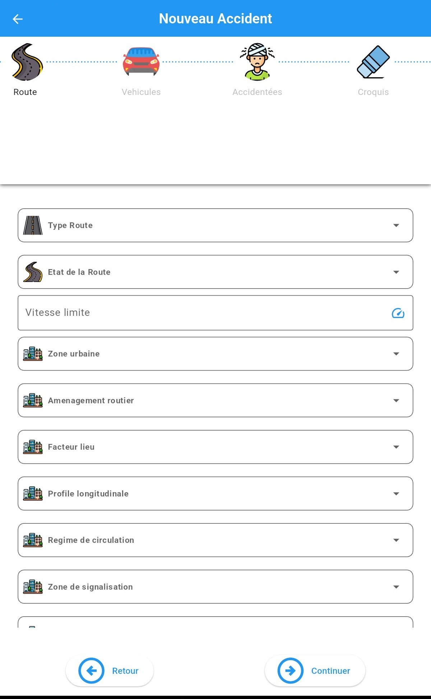
.. centered:: Road information

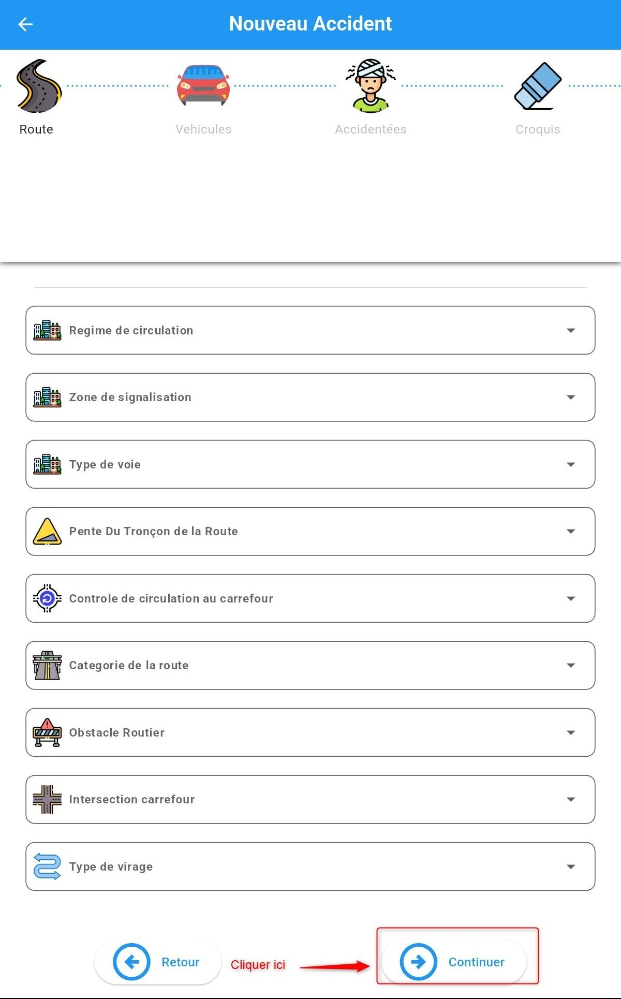
.. centered:: Road information

Click **Continue** to proceed to the next step.

.. _refPoliceVehiculesConserne:

Involved Vehicles  
------------------

Enter details about the vehicles involved in the accident. Click the add button as shown in the image below to add a vehicle.

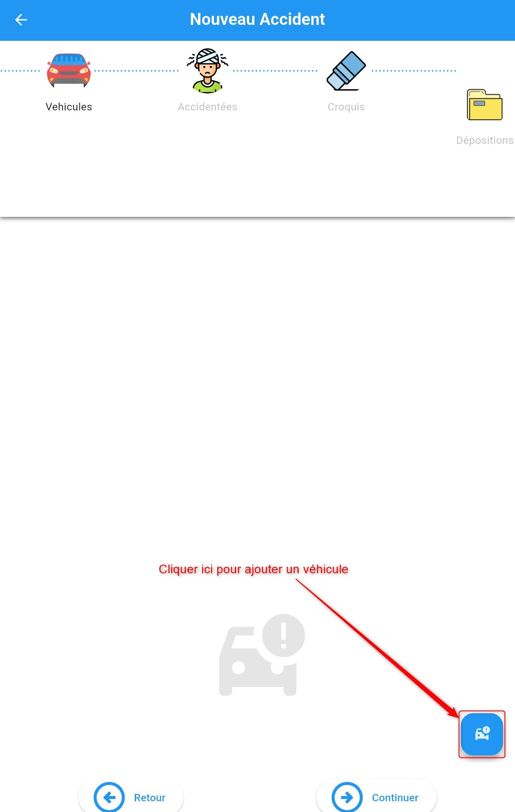
.. centered:: Adding a vehicle

Adding a vehicle involves two steps: **Vehicle information** and **Accident details**.

**1. Vehicle information**

Fill in the vehicle details in the form in two ways:

* By searching for a pre-registered vehicle in the search field. If found, selecting it will auto-fill the fields.  
* By manually entering all the information.  

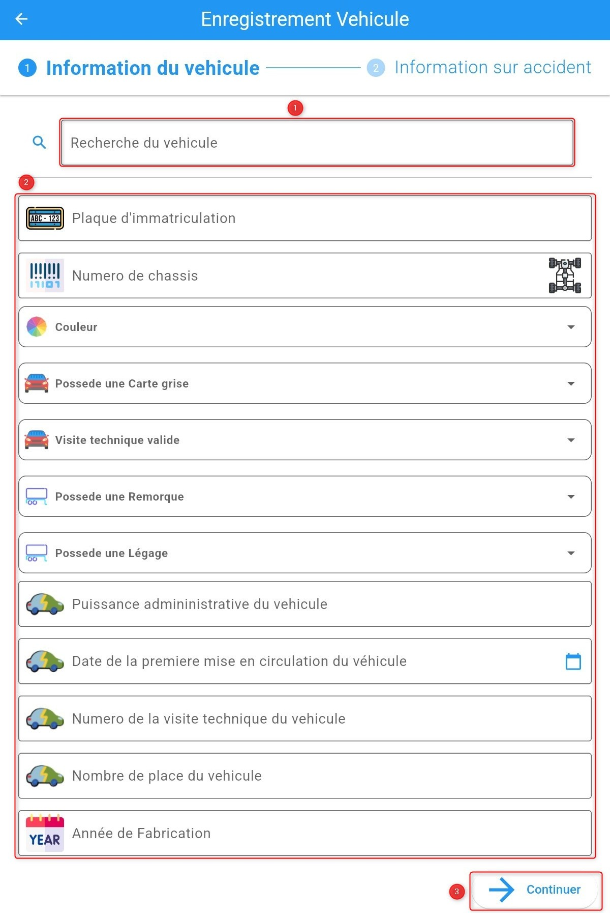
.. centered:: Vehicle addition form

   1. Search for a pre-registered vehicle to auto-fill fields  
   2. Or manually complete the form  
   3. Click **Next**  

**2. Accident details**

Fill in accident-related information about the vehicle.

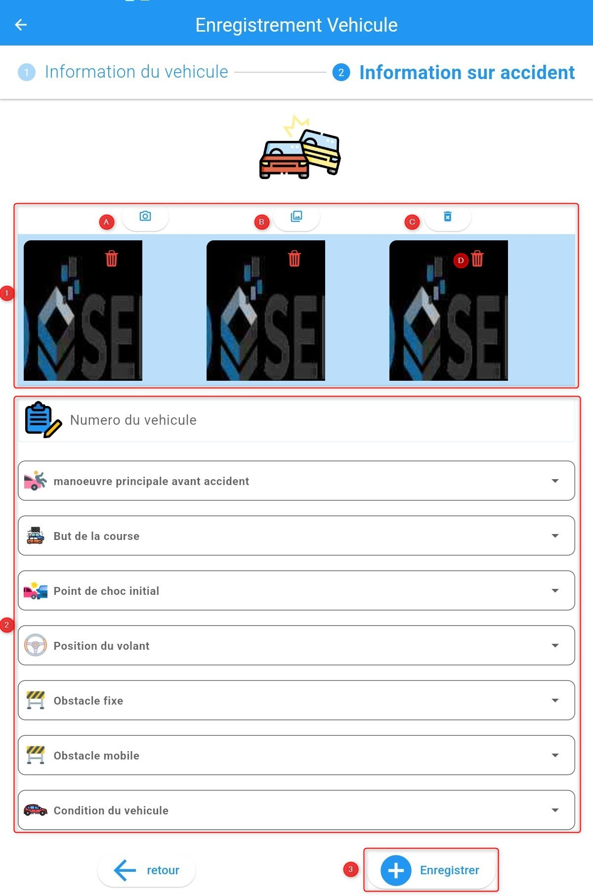
.. centered:: Vehicle accident information

Click **Save** to confirm. You can add more vehicles or click **Continue**.

.. _refPoliceUsagersConcerne:

Injured Users
-------------

Enter details about the individuals involved in the accident. Click the add button as shown below.

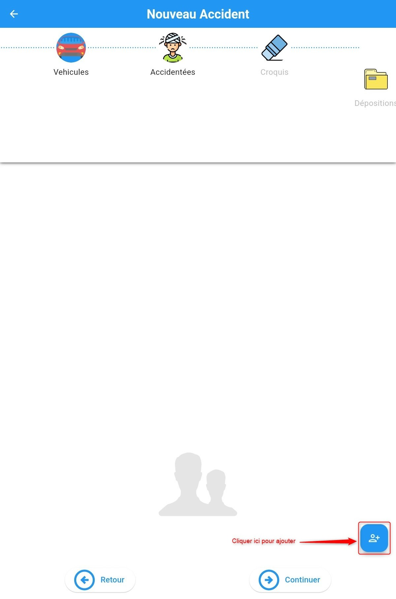
.. centered:: Adding an injured user

Fill in the details in the displayed form.

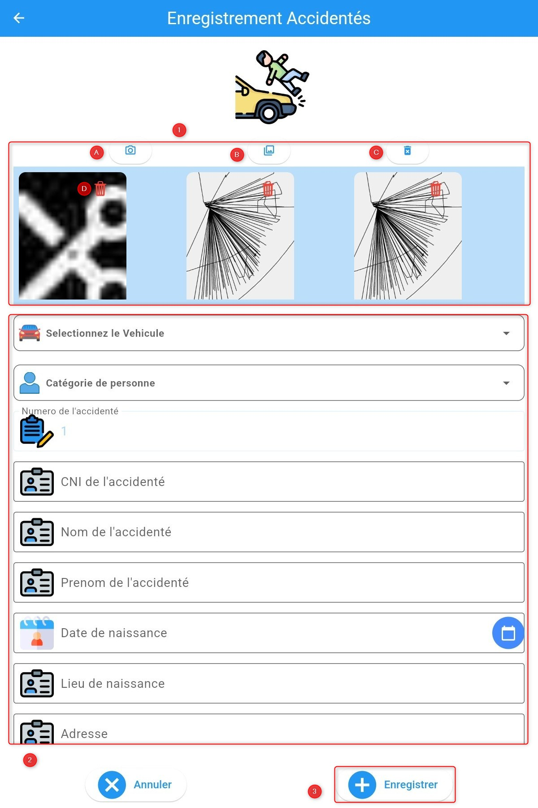
.. centered:: Injured user form

Click **Save**, then **Continue** to proceed.

.. _refPoliceCroqui:

Sketch
------

After clicking **Continue**, a drawing interface appears where you can create a sketch of the accident scene and save it.

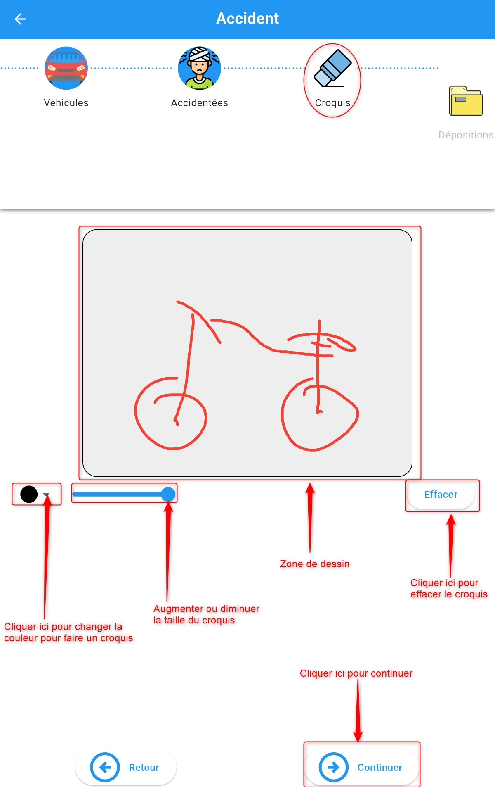
.. centered:: Adding a sketch

Click **Continue** to proceed.

.. _refPoliceDeposition:

Statements
----------

In the statement section, you can add new statements by clicking the add button. You can also enter observations and remarks.

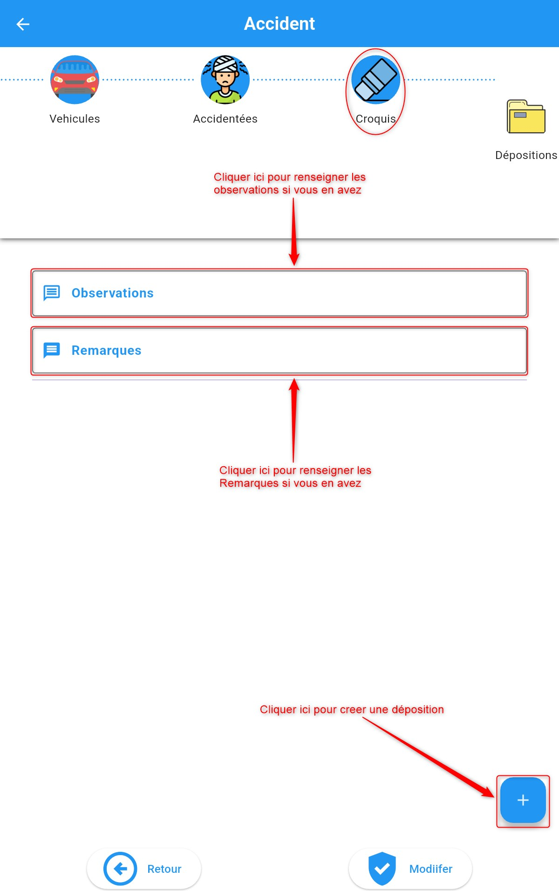
.. centered:: Statement addition home screen

After adding the statement, click **Save**.

.. image:: ../Images/img-police1&2/DuneDepositionCree.jpg
    :align: center
.. centered:: Created statement

Click **Finish** to complete the accident declaration and return to the list of reported accidents.

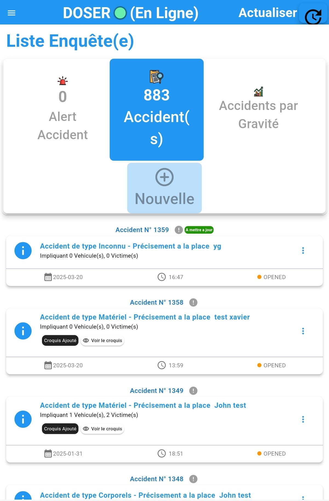
.. centered:: List of declarations
