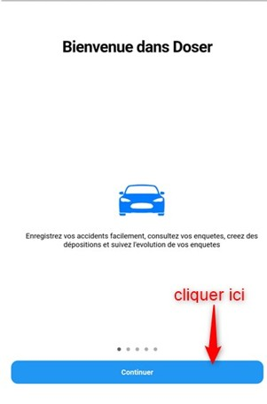
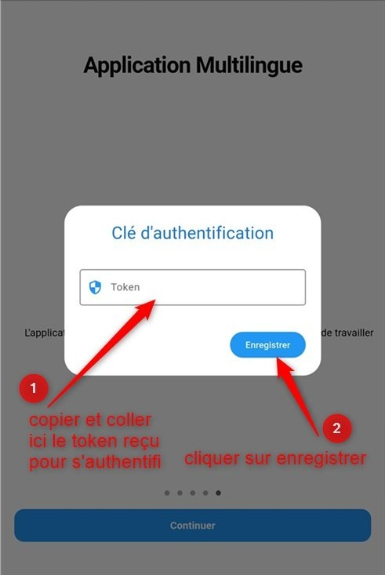

Logging into the DOSER MOBILE Application
=========================================

After installing the mobile application on your handset (phone, tablet, etc.),  
double-click on the DOSER application icon.

Presentation screens of the application will be displayed. After reading them, click **Continue**.

.. centered:: Application startup screen

At the end of the presentation screens, the authentication screen will appear:

.. centered:: Mobile application authentication screen
