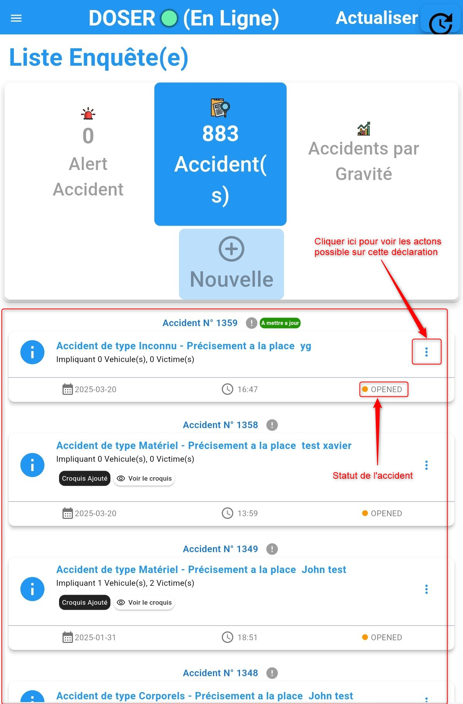
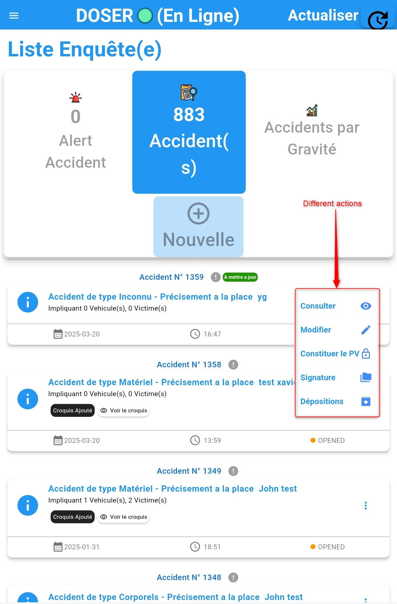
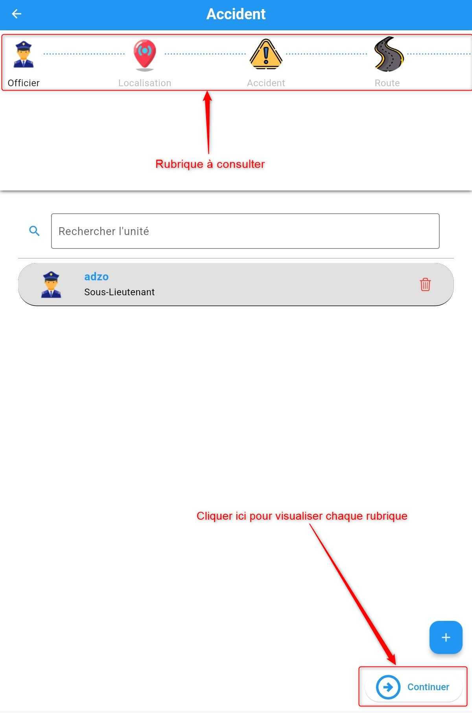
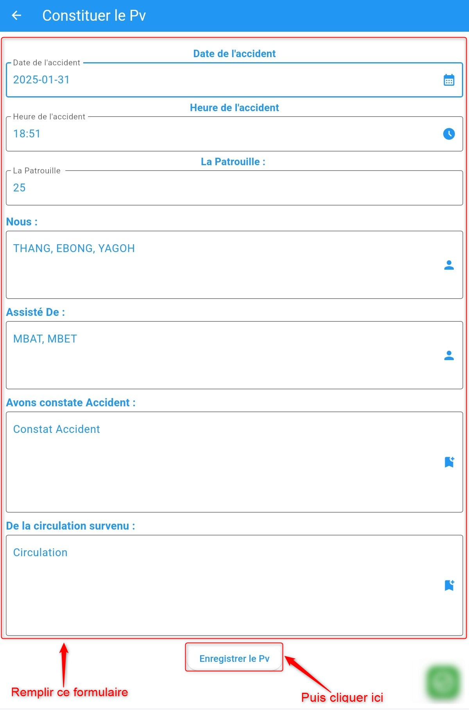
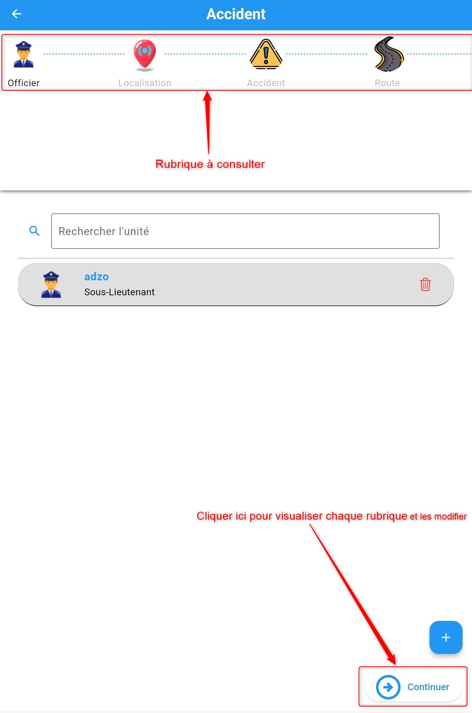
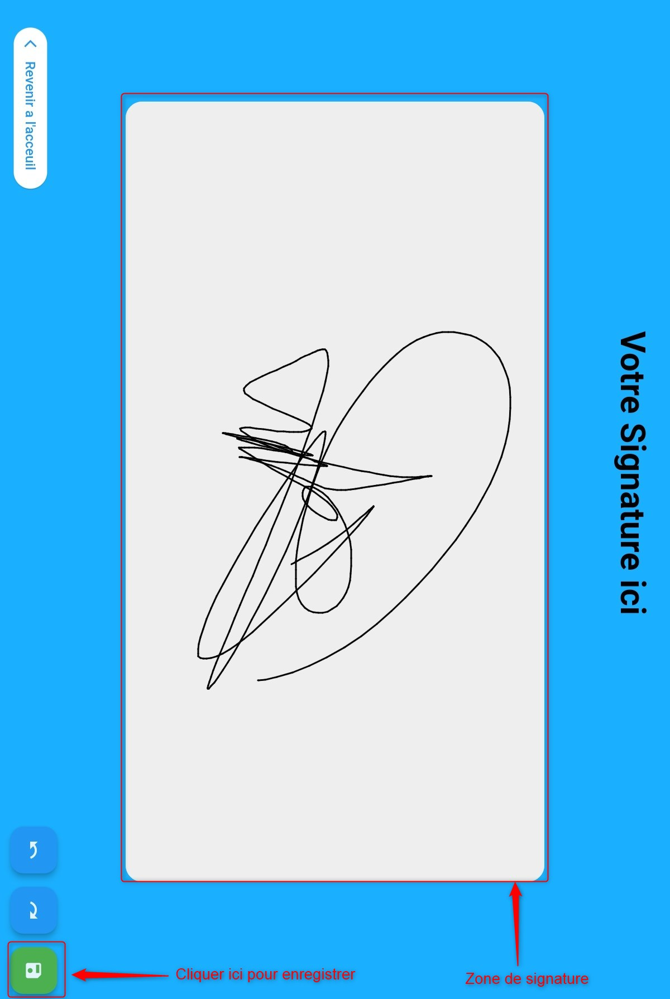
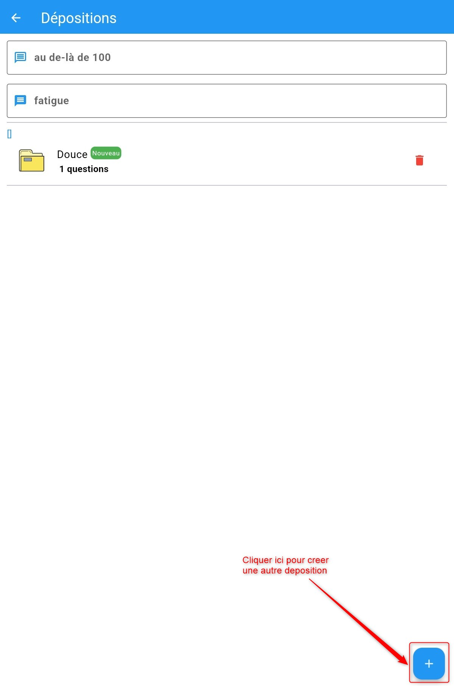

Enhancing the Declaration
=========================

After completing the accident declaration process, the accident status changes to **"OPENED"**,  
which will be displayed in the declaration list.  
:ref:`Click here to learn more about declaration statuses. <knowStatu>`

.. centered:: Declaration list.

Once you access the accident list, you will see accidents listed from the most recent to the oldest.  
To finalize the accident declaration process, click on **"the three dots on the right side of the created accident"**  
for the accident you just added, which has the status **"OPENED"**.  
You will then see a list of possible actions you can perform. These actions include:

* :ref:`View declaration details <refPoliceVisualiserDetail>`
* :ref:`Generate the PDF report of the declaration <refPoliceRapportPD>`
* :ref:`Generate the official report of the declaration <refPoliceProcesVerbal>`
* :ref:`Edit the declaration <refPoliceModifierDeclaration>`
* :ref:`Add a sketch <refPoliceAjouterDeposition>`
* :ref:`Sign the report <refPoliceSignerRapport>`

.. _refPoliceActionsPossiblesDeclaratio:

.. centered:: Possible actions on a declaration.

.. _refPoliceVisualiserDetail:

Viewing Declaration Details
+++++++++++++++++++++++++++

To view the details of a declaration, click **View** in the list of available actions  
for an accident declaration. Once you click **View**, as shown  
:ref:`here <refPoliceActionsPossiblesDeclaratio>`, the following interface will appear:

.. centered:: Viewing accident declaration details

Click **Continue** to review all eight sections.

.. _refPoliceRapportPD:

PDF Report
++++++++++

To obtain the PDF report of a declaration, click **Generate Report** in the list of available actions  
for an accident declaration. Once you click **Generate Report**, as shown  
:ref:`here <refPoliceActionsPossiblesDeclaratio>`, the following interface will appear:

.. centered:: Generating the report

.. _refPoliceModifierDeclaratio:

Editing the Declaration
+++++++++++++++++++++++

By clicking **Edit**, you can make changes to the declaration. A page will be displayed  
showing the different sections filled in during the accident declaration process.  
Click on the tab you wish to modify, update the details, and click **Save**.  
Once you click **Edit**, as shown  
:ref:`here <refPoliceActionsPossiblesDeclaratio>`, the following interface will appear:

.. centered:: Editing the declaration

Click **Continue** to edit the eight sections as needed.

.. _refPoliceSignerRappor:

Signing the Report
++++++++++++++++++

To sign the report, click **Sign** in the list of available actions  
for an accident declaration. Once you click **Sign**, as shown  
:ref:`here <refPoliceActionsPossiblesDeclaratio>`, the following window will appear:

.. centered:: Signature added

Sign and save the signature by clicking the **Save** button, as shown in the image above.

.. _refPoliceAjouterDeposition:

Adding a Deposition
+++++++++++++++++++

To add a deposition to a declaration, click **Deposition** in the list of available actions  
for an accident declaration. Once you click **Deposition**, as shown  
:ref:`here <refPoliceActionsPossiblesDeclaratio>`, the following window will appear:

.. centered:: Adding a deposition  

After clicking the **Create Deposition** button, you will be directed  
to the following section: :ref:`Learn more <refPoliceDeposition>`
