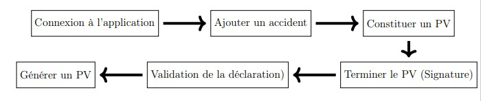
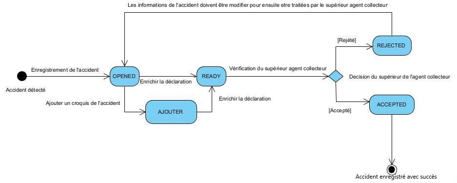

STATES AND DESCRIPTIONS
=======================

This procedure consists of two steps:

* **Accident declaration:** The main actor in the declaration process is a police or gendarmerie officer (Collecting Agent).
* **Accident validation:** The main actor in the validation process is an agent with the authority to validate recorded declarations.

To achieve this, the steps to follow are as follows:

It is also important to understand the different statuses that registered vehicles  
will go through in the application.

.. centered:: Declaration State Diagram

.. _knowStatu:

The descriptions of these states are as follows:

.. list-table:: State Descriptions
   :widths: 20 30
   :header-rows: 1
   :class: tight-table

   * - States
     - Descriptions
   * - OPENED
     - When an accident has been detected, and the declaration officer enters the observed information to generate an official accident report. At this stage, the officer can review or modify the previously entered information. To proceed, they must add a sketch, prepare the report, generate the report, and finally sign it to complete the process.
   * - READY
     - At this stage, all accident-related information has been entered by the collecting agent. It is now up to the superior officer to validate or reject the information regarding the accident.
   * - REJECTED
     - Here, the superior officer has rejected the accident-related information and has provided a reason for the rejection. The collecting agent must consider this reason and modify the previously provided information accordingly.
   * - ACCEPTED
     - The superior officer has validated the accident information and confirmed it with their signature.
   * - ADD
     - This occurs when the collecting agent adds a sketch to the declaration, regardless of its status, before the declaration is validated by the superior officer.
