Enhancing the Declaration
=========================

After completing the accident declaration process, the accident status changes to **"OPENED"** and will be displayed in the declaration list.  
:ref:`Click here to learn more about declaration statuses. <knowStatus>`

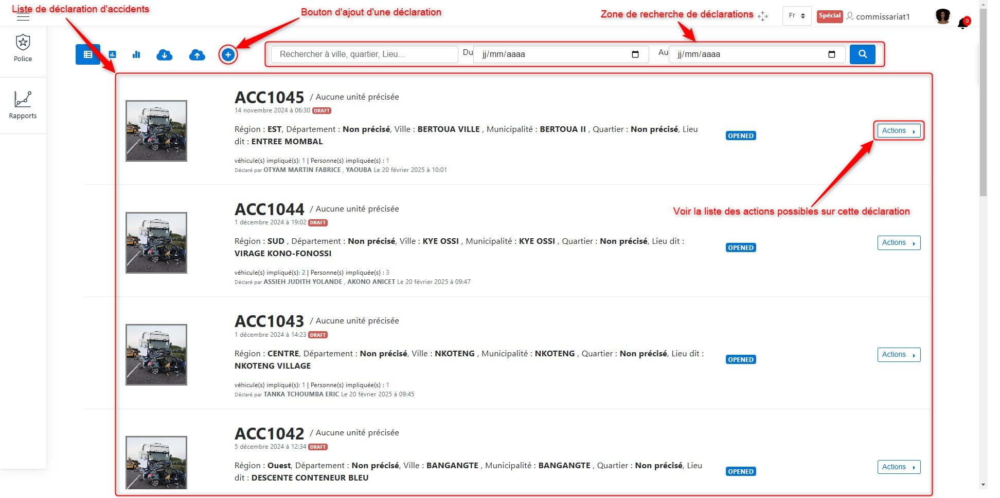
.. centered::  List of declarations.

By clicking on the **Actions** button, as shown above, you can see the list of possible actions for declarations. These actions include:

* :ref:`View declaration details <refPoliceViewDetails>`
* :ref:`Generate the PDF report of the declaration <refPolicePDFReport>`
* :ref:`Generate the official report of the declaration <refPoliceOfficialReport>`
* :ref:`Edit the declaration <refPoliceEditDeclaration>`
* :ref:`Add a sketch <refPoliceAddSketchDeclaration>`
* :ref:`Sign the report <refPoliceSignReport>`

.. _refPoliceAvailableActionsDeclaration:

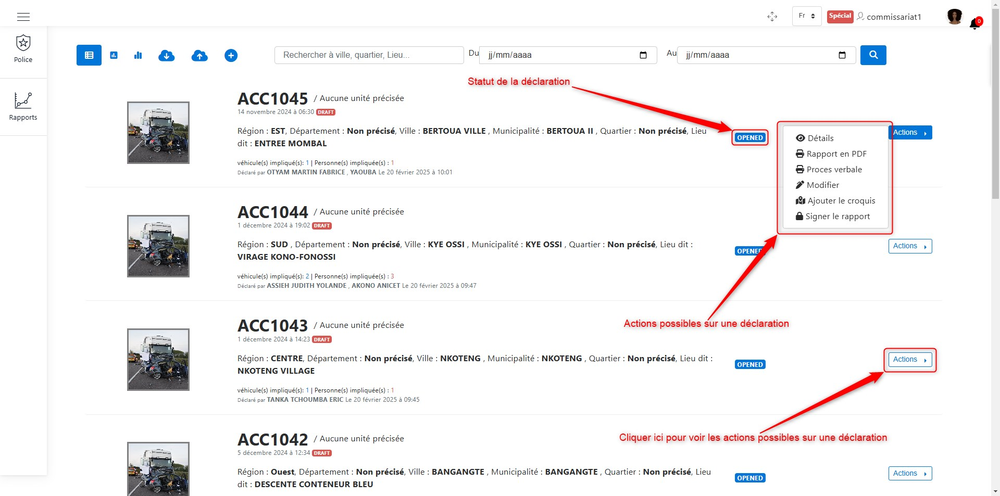
.. centered::  Available actions on a declaration.

.. _refPoliceViewDetails:

Viewing Declaration Details
+++++++++++++++++++++++++++

To view the details of a declaration, click on **Details** in the list of available actions for an accident declaration. Once you click on  
**Details**, as shown :ref:`here <refPoliceAvailableActionsDeclaration>`, the following interface will be displayed:

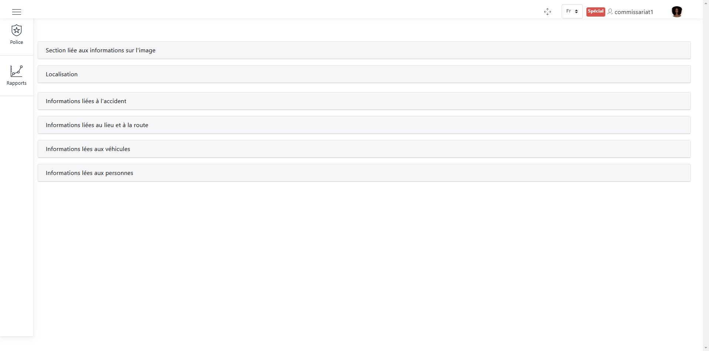
.. centered::  Sections of a declaration.

For each of the following sections, click on the section name to view its details.

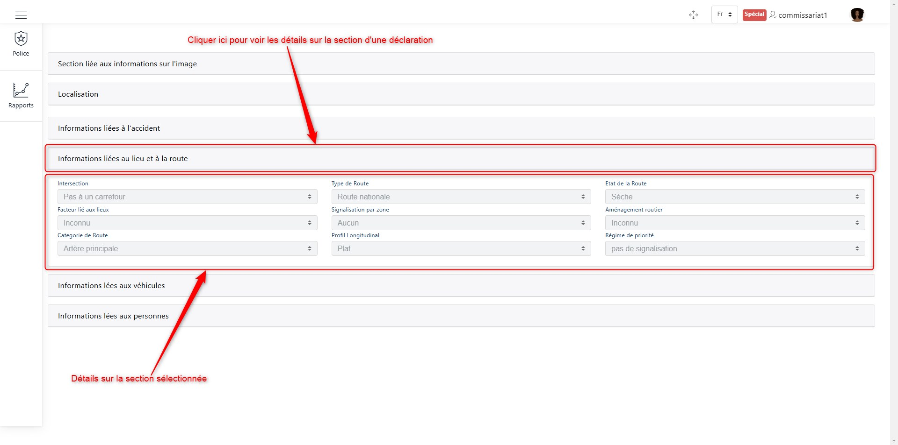
.. centered::  View details of a declaration section.

.. _refPolicePDFReport:

PDF Report
++++++++++

To obtain the PDF report of a declaration, click on **PDF Report** in the list of available actions for an accident declaration.  
Once you click on **PDF Report**, as shown :ref:`here <refPoliceAvailableActionsDeclaration>`, the following interface will be displayed:

.. _refPoliceOfficialReport:

Official Report
+++++++++++++++

To obtain the official report of a declaration, click on **Official Report** in the list of available actions for an accident declaration.  
Once you click on **Official Report**, as shown :ref:`here <refPoliceAvailableActionsDeclaration>`, the following interface will be displayed:

.. _refPoliceEditDeclaration:

Editing the Declaration
+++++++++++++++++++++++

To edit a declaration, click on **Edit** in the list of available actions for an accident declaration.  
Once you click on **Edit**, as shown :ref:`here <refPoliceAvailableActionsDeclaration>`, the following interface will be displayed:

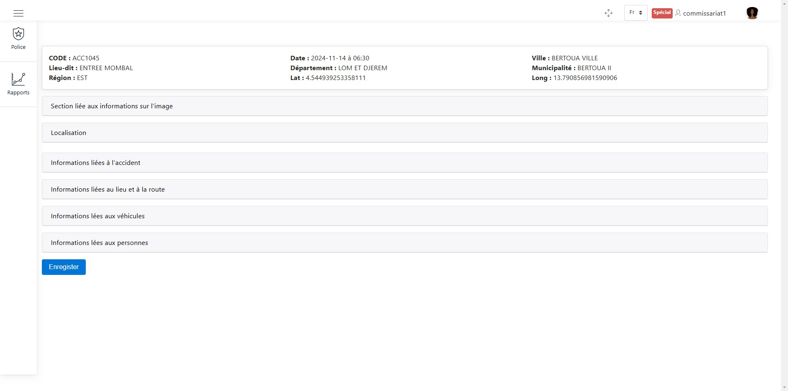
.. centered::  List of editable sections in a declaration.

The sections that can be modified include:

* The section related to image information
* The location
* Information related to the accident
* Information about the location and road
* Information about vehicles
* Information about people

Editing Image Information
-------------------------

The following image shows how to modify existing images or add a new image if it does not exist.

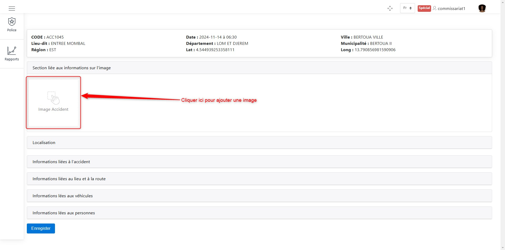
.. centered::  Modify the image.

Select the image and confirm.

Editing Location
----------------

You can modify the location by entering the latitude and longitude manually or by selecting the location on the map, as shown below.

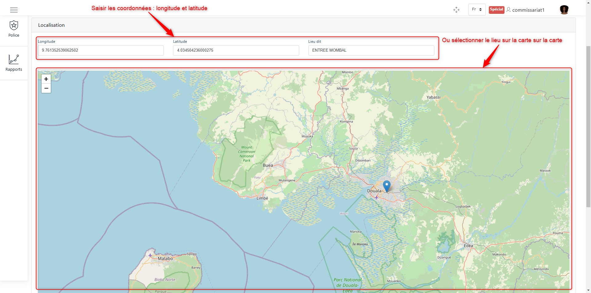
.. centered::  Modify the location.

Editing Accident Information
----------------------------

Modifying this section simply involves updating the relevant fields.

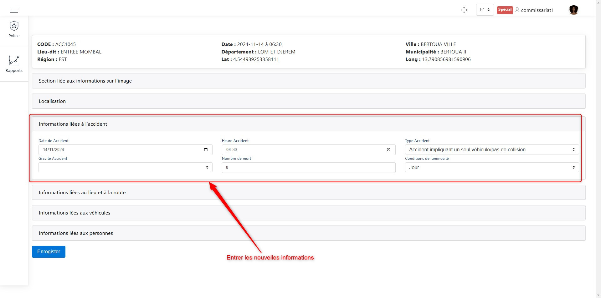
.. centered::  Modify accident information.

Editing Location and Road Information
-------------------------------------

Updating this section involves modifying the required fields.

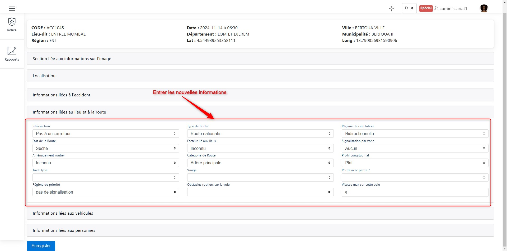
.. centered::  Modify location and road information.

Editing Vehicle Information
---------------------------

Here, you can modify the vehicles from the initial declaration and add new vehicles to the declaration.

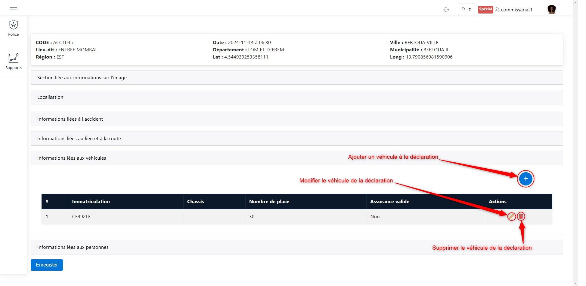
.. centered::  Modify vehicles in the declaration.

:ref:`Learn more <refPoliceVehiculesConsernes>` about adding, deleting, and modifying vehicles.

Editing Person Information
--------------------------

Here, you can modify the people recorded in the initial declaration and add new individuals to the declaration.

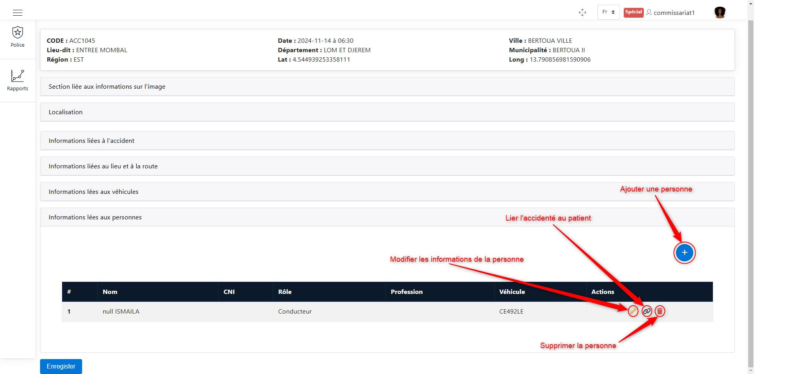
.. centered::  Modify people in the declaration.

:ref:`Learn more <refPoliceUsagersConcernes>` about adding, deleting, and modifying individuals.

To link an accident victim to a patient, click on the link button shown above, then search for the patient using the search bar,  
which will appear as follows.

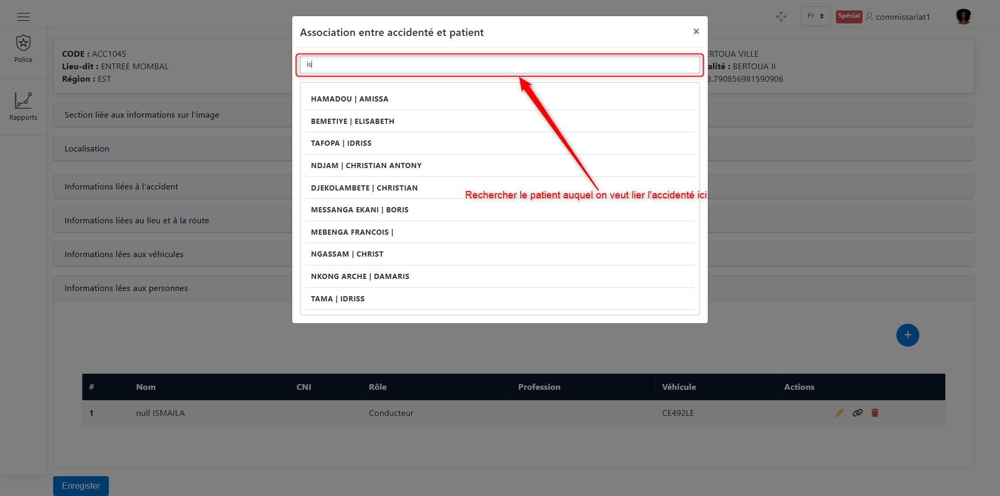
.. centered::  Linking the accident victim to a patient.

Once you find the patient, simply select them.

When you have finished making the necessary modifications to the accident declaration,  
click the **Save** button at the bottom of the page, as shown below.

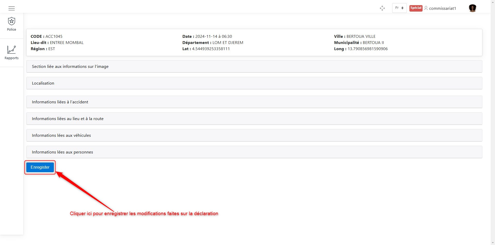
.. centered::  Save modifications to the declaration.

.. _refPoliceAddSketchDeclaration:

Adding a Sketch
+++++++++++++++

To add a sketch to a declaration, click on **Add Sketch** in the list of available actions for an accident declaration.  
Once you click on **Add Sketch**, as shown :ref:`here <refPoliceAvailableActionsDeclaration>`, the following window will appear:

.. _refPoliceModifInsertSketch:

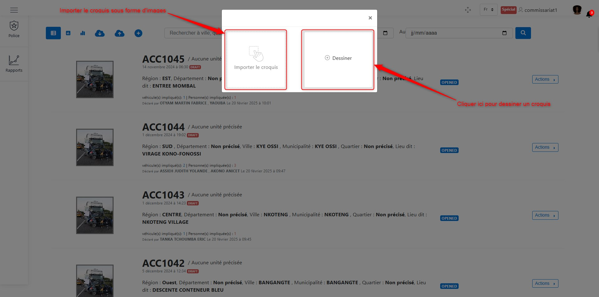
.. centered::  Add a sketch.

As shown in the image above, there are two options:

* Draw the sketch directly within the application
* Import a sketch image

**Method 1:** Drawing in the application

To draw within the application, click the **Draw** button,  
as illustrated in :ref:`the following image <refPoliceModifInsertSketch>`.  
Once clicked, you will be redirected to the sketch drawing interface.

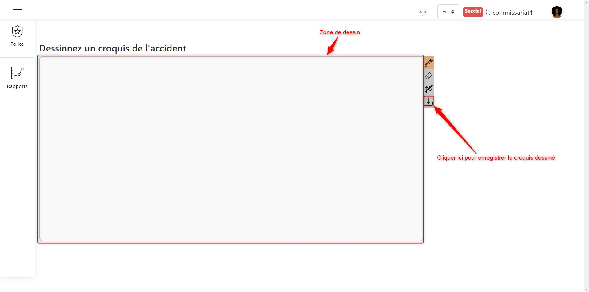
.. centered:: Drawing area.

Do not forget to save your sketch using the save button shown in the image above.

**Method 2:** Importing an image

To import a sketch image, click the image import button,  
as illustrated in :ref:`the following image <refPoliceModifInsertSketch>`.  
Once clicked, a window will open, allowing you to browse for the sketch image to import.

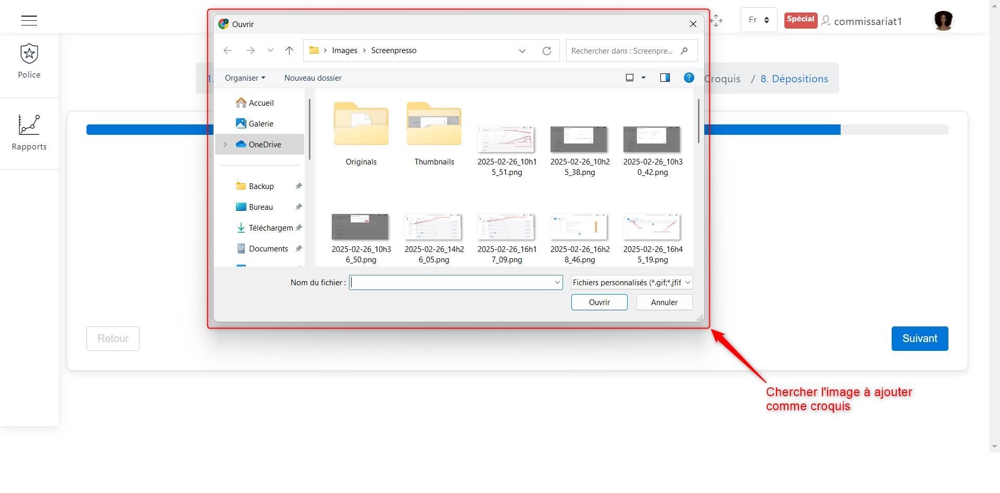
.. centered:: Import a sketch image.

.. _refPoliceSignReport:

Signing the Report
++++++++++++++++++

To sign the report, click on **Sign Report** in the list of available actions for an accident declaration.  
Once you click on **Sign Report**, as shown :ref:`here <refPoliceAvailableActionsDeclaration>`,  
the following window will appear:

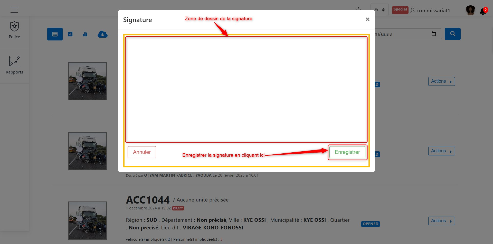
.. centered:: Sign the report.

Sign and save your signature by clicking on the **Save** button, as shown in the image above.
