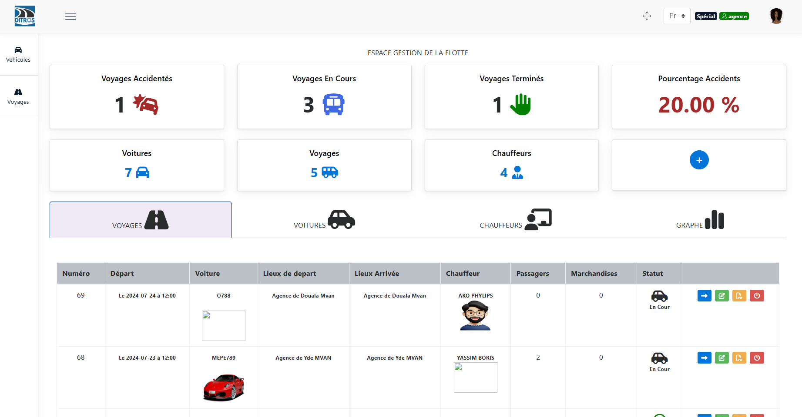

Connecting to the Fleet Management Web Application
===================================================

This section is intended for individuals who own a fleet of vehicles to assist them in their management tasks.

In this regard, DOSER offers these individuals a range of features, including:

* Creating and tracking trips
* Adding vehicles
* Adding drivers
* Assigning a driver and a vehicle to a trip
* Adding routes
* Adding locations (here, this refers to departure and arrival points)

All of this is provided through a fairly intuitive user interface.

In the search bar of your browser, enter the server IP address. In our case, it is **“51.195.11.202:8098”**. Then press the “Enter” key on your keyboard.

    * **Enter your login credentials (username and password)**

You will be presented with a login interface. Enter your login credentials:

        * Your username
        * Your password

Then click **“LOGIN”**.

.. image:: ../Images/img-police1&2/Connex.jpg
    :name: Application Login
.. centered:: Application Login

Once logged in, you should see an interface similar to the one below:

.. centered:: Fleet Management Home
