APPLICATION FEATURES
====================

The actions that can be undertaken regarding fleet management are:

Creating Trips
++++++++++++++

A trip can be created in two different ways: either directly on the **Dashboard** or in the **"Trips"** section.

**1** On the **Dashboard**:

To create a trip, click on the **+** button as shown in the following interface:

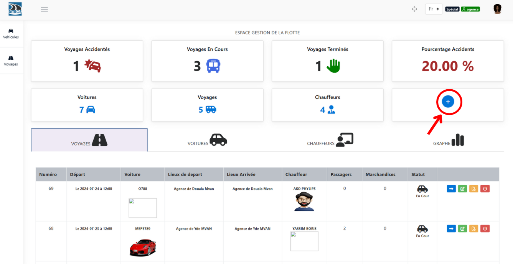
.. centered:: Fleet management dashboard

Fill in the information in the following three sections:

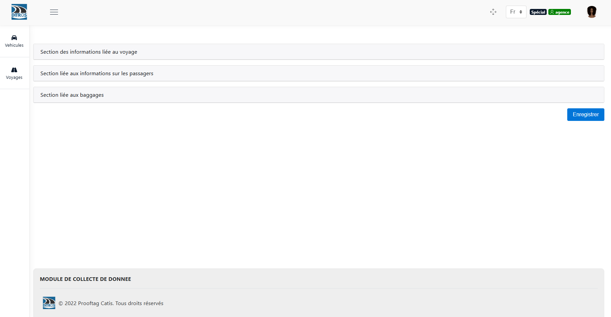
.. centered:: Sections to fill in

Fill in the information in **the trip information section**: Here you enter the vehicle details, the day & time of the trip, the driver involved, and the departure & arrival points.

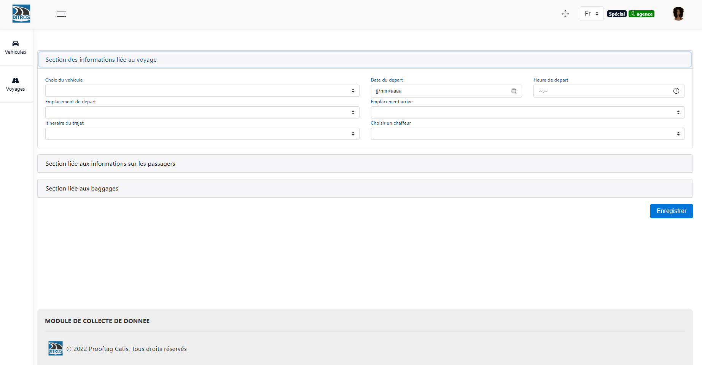
.. centered:: Trip information section

Fill in the information in **the passenger information section**: In this section, you need to register all the passengers who will be taking this trip.

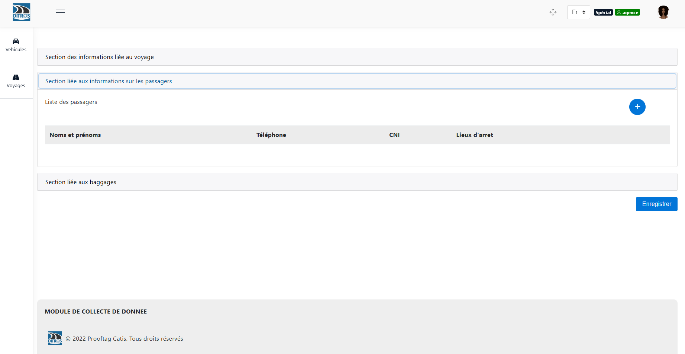
.. centered:: Passenger information section

Fill in the information in **the baggage information section**: Here, you will provide details about the various baggage items. Finally, click on the **"Save"** button to finalize the trip creation.

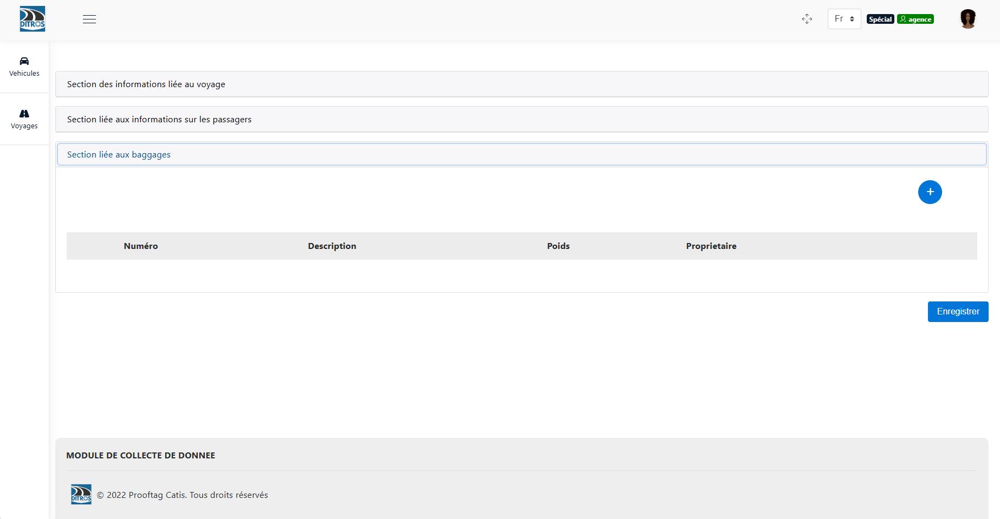
.. centered:: Baggage information section

**2** In the **"Trips"** section:

To create a trip, go to the **Trips** section, then click on **Trips**:

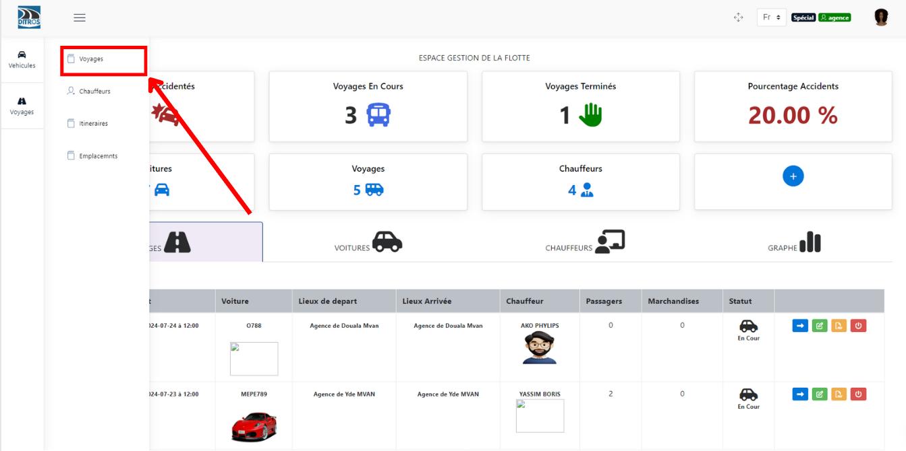
.. centered:: Fleet management dashboard

Fill in the information in the following three sections:

.. centered:: Sections to fill in

Fill in the information in **the trip information section**: Here you enter the vehicle details, the day & time of the trip, the driver involved, and the departure & arrival points.

.. centered:: Trip information section

Fill in the information in **the passenger information section**: In this section, you need to register all the passengers who will be taking this trip.

.. centered:: Passenger information section

Fill in the information in **the baggage information section**: Here, you will provide details about the various baggage items. Finally, click on the **"Save"** button to finalize the trip creation.

.. centered:: Baggage information section

Adding Vehicles
+++++++++++++++

To add a vehicle, go to the **Vehicles** section, then click on **Cars**:

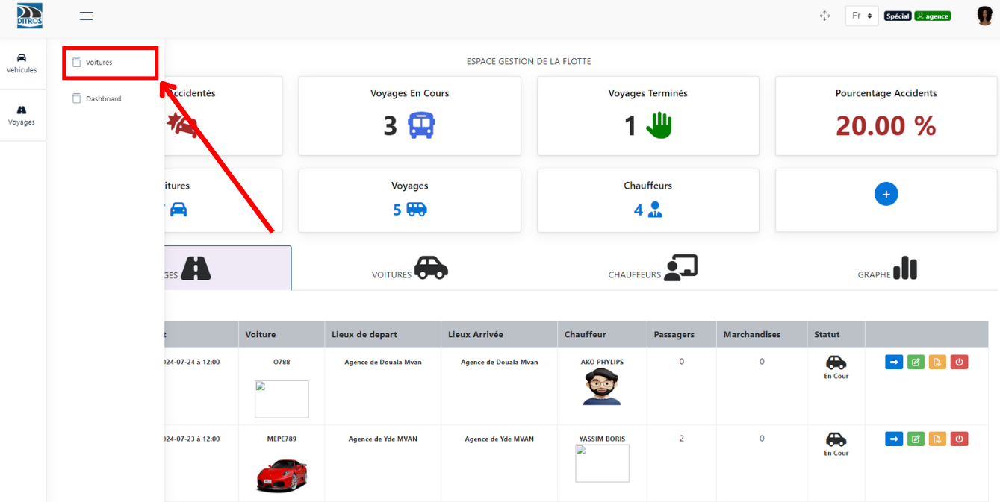
.. centered:: Cars tab

Then click on the **+** button as shown in the following interface:

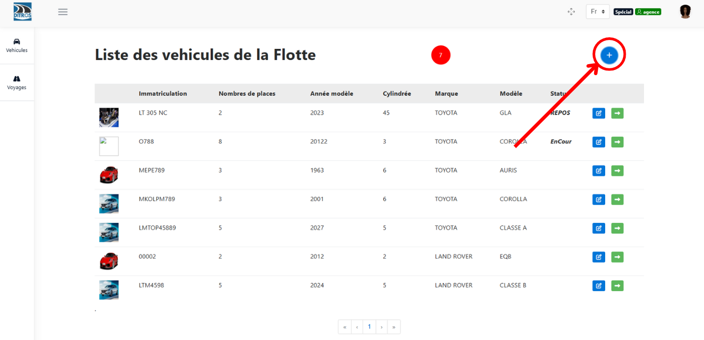
.. centered:: List of cars

Fill in the vehicle information, then click on **"Save"** to finalize the addition.

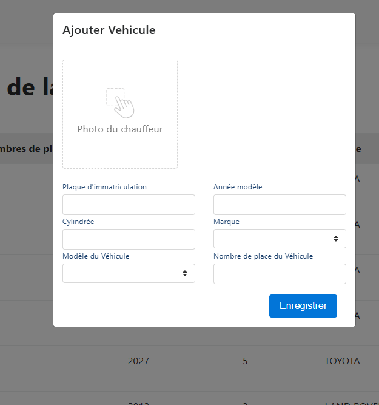
.. centered:: Vehicle information

Adding a Driver
+++++++++++++++

To add a driver, go to the **Trips** section, then click on **Drivers**:

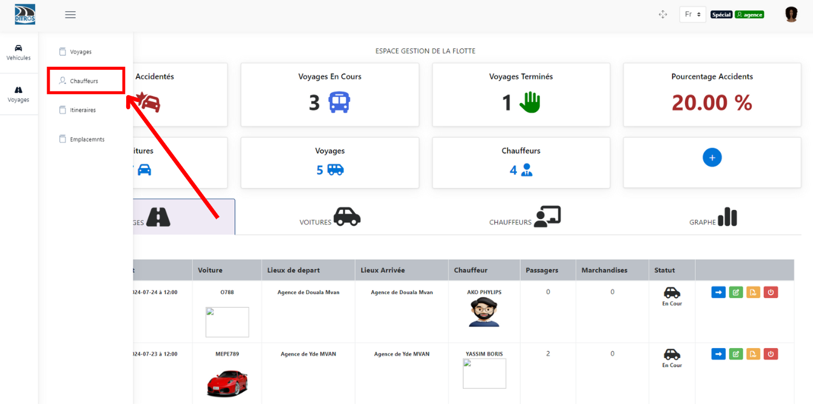
.. centered:: Drivers tab

Then click on the **+** button as shown in the following interface:

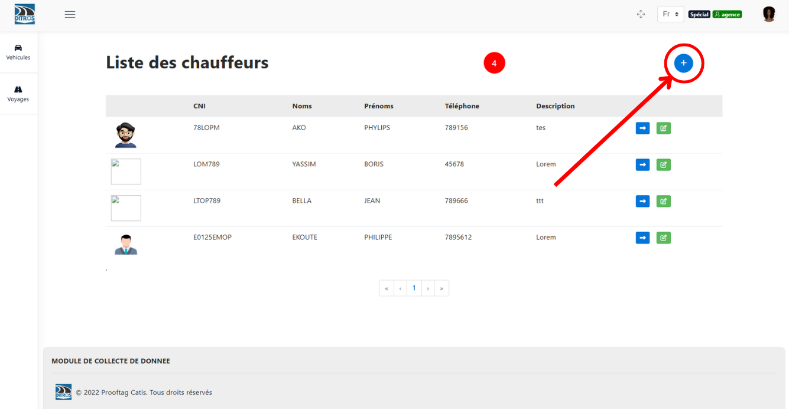
.. centered:: List of drivers

Fill in the driver's information, then click on **"Save"** to finalize the addition.

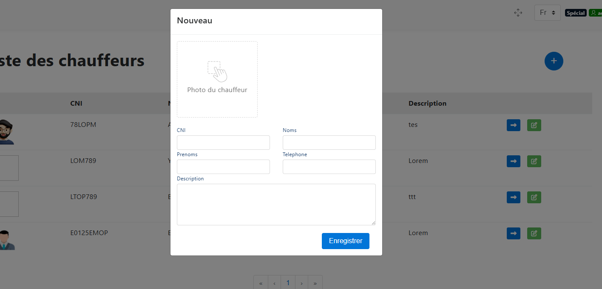
.. centered:: Driver information

Adding an Itinerary
+++++++++++++++++++

To add an itinerary, go to the **Trips** section, then click on **Itineraries**:

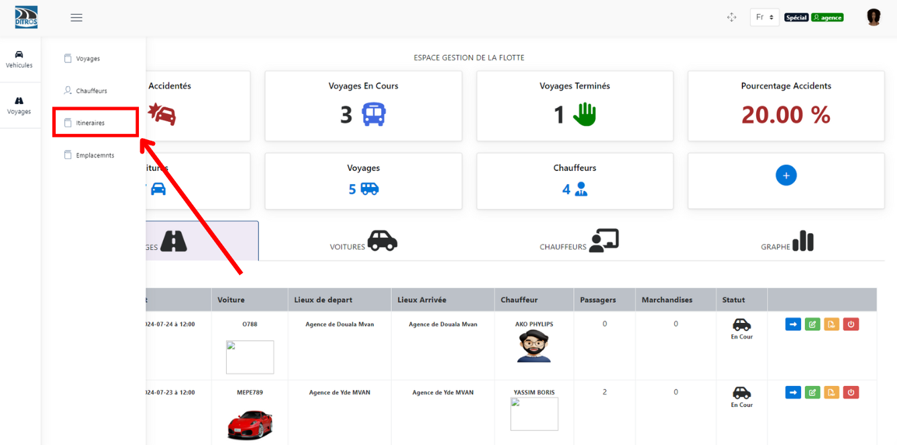
.. centered:: Itineraries tab

Then click on the **+** button as shown in the following interface:

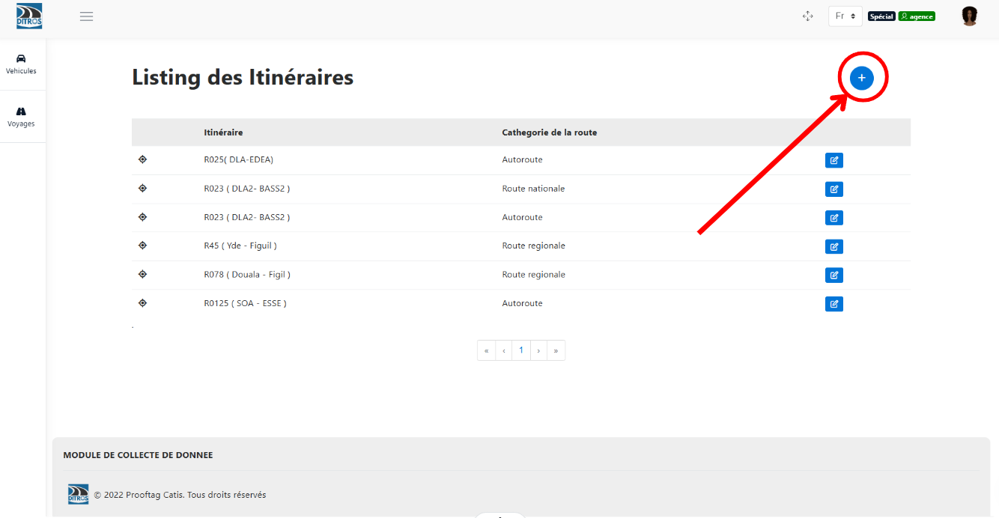
.. centered:: List of itineraries

Fill in the itinerary information, then click on **"Save"** to finalize the addition.

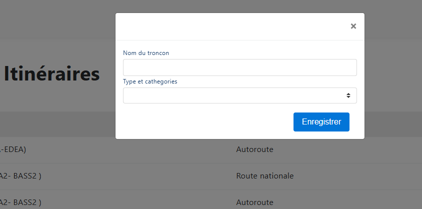
.. centered:: Itinerary information

Adding Locations
++++++++++++++++

Here, a location refers to either a departure point or an arrival point.

To add a location, go to the **Trips** section, then click on **Locations**:

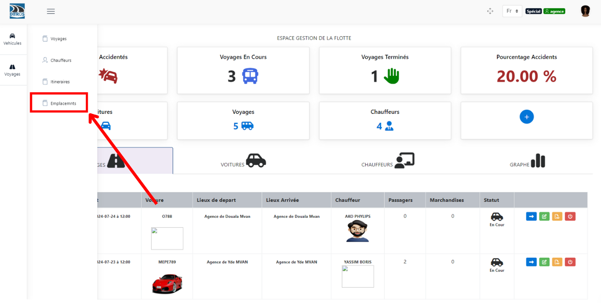
.. centered:: Locations tab

Then click on the **+** button as shown in the following interface:

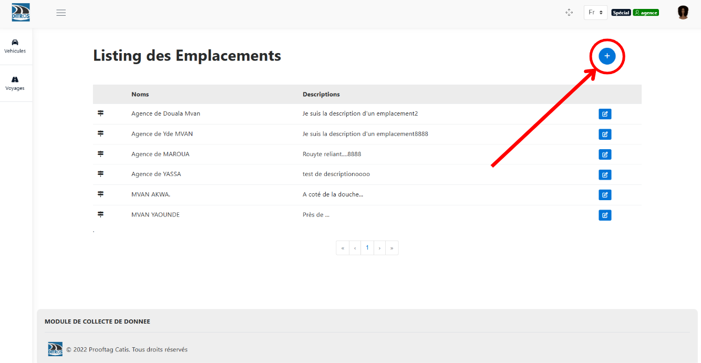
.. centered:: List of locations

Fill in the location information, then click on **"Save"** to finalize the addition.

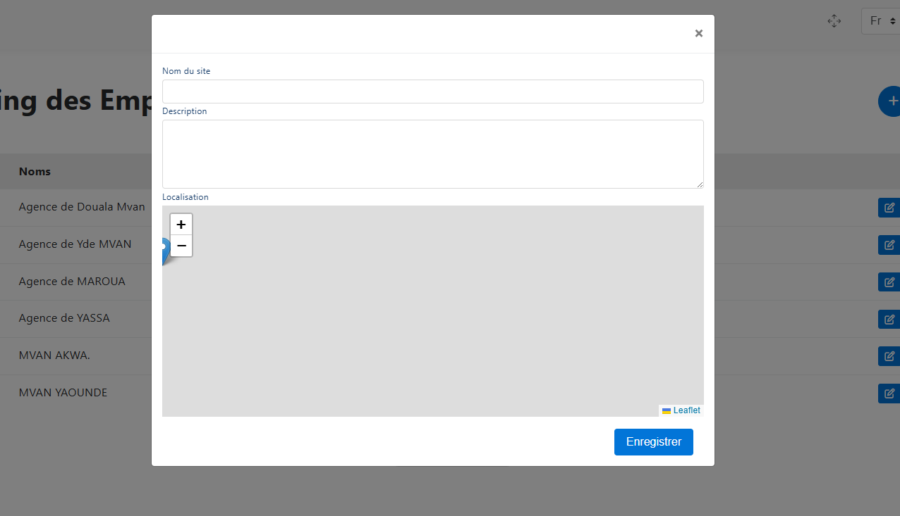
.. centered:: Location information
