PRODUCT AND SERVICE CONFIGURATION
=================================

The product and service configuration step is a crucial step for each hospital facility.  
Before using the features of this application,  
each hospital facility must enter the prices of the various examinations, treatments,  
medications, and its different categories of rooms, as prices depend on the organization.

**NB:** This configuration is done only once.

.. _refConfiguration:

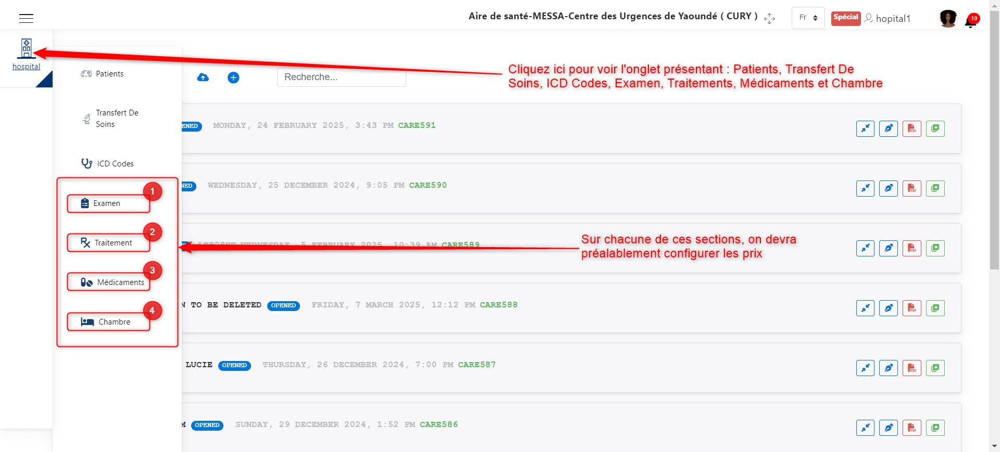
.. centered:: Product and Service Configuration.

As we can see in the image above, there are four main products and services  
for which we need to configure prices:

**1.** :ref:`Examinations <refLesExamens>`

**2.** :ref:`Treatments <refLesTraitements>`

**3.** :ref:`Medications <refLesMedicaments>`

**4.** :ref:`Rooms <refLesChambres>`

We will now explain how to configure the prices of these products and services one by one.

.. _refLesExamens:

Examinations
------------

Click on **1** as shown in :ref:`the following image <refConfiguration>`  
to access the examination configuration interface.

The image below shows the examination configuration interface.  
The actions that can be performed here are:

* Adding a new examination
* Updating examination information
* Deleting an examination

.. _refExams:

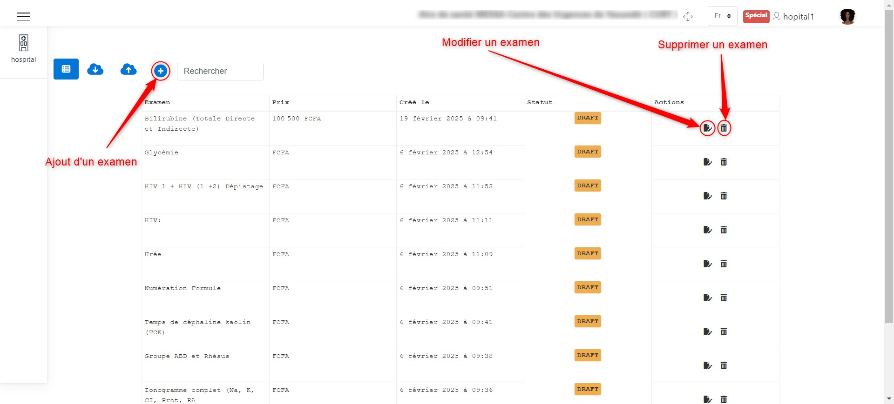
.. centered:: Examination Configuration.

When clicking on **+** to add an examination, as indicated :ref:`here <refExams>`, a window appears  
where you can enter the examination details, such as its name and price.

Click the **Save** button to confirm the addition of the examination.  
The image below illustrates this scenario.

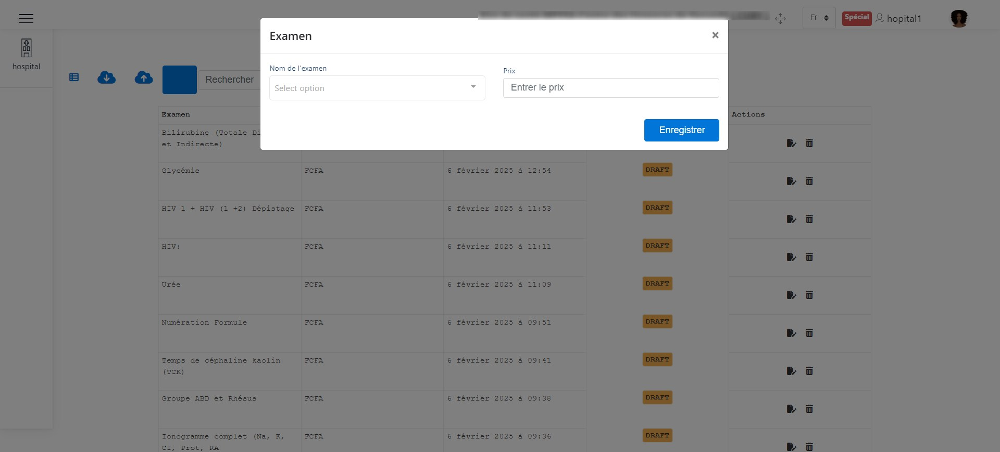
.. centered:: Add an Examination.

To modify an examination, click the edit button  
as shown in :ref:`the following image <refExams>`. A window will appear  
allowing you to modify the previously saved information.

Click the **Save** button to confirm the changes.  
The image below illustrates this scenario.

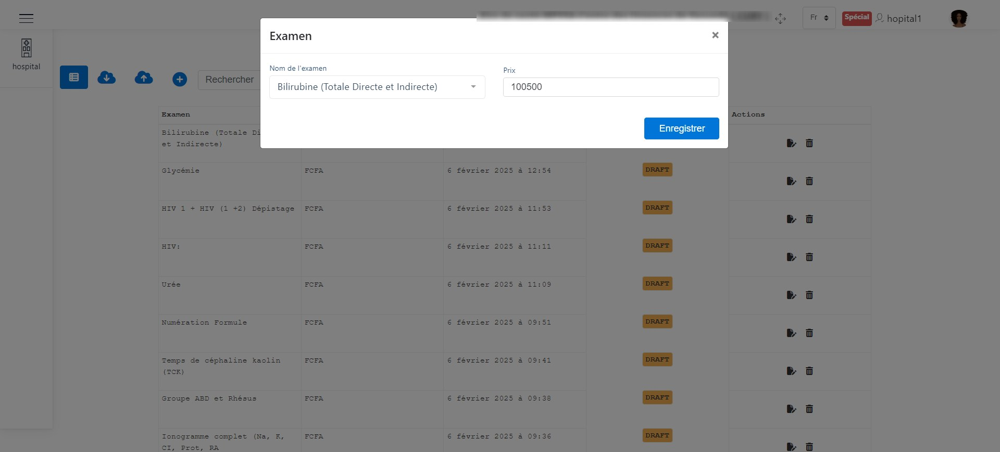
.. centered:: Edit an Examination.

To delete an examination, click the delete button  
as shown in :ref:`the following image <refExams>`. A window will appear  
allowing you to confirm the deletion of the examination.

Click the **Delete** button to confirm the deletion  
or the **Cancel** button to cancel the operation.  
The image below illustrates this scenario.

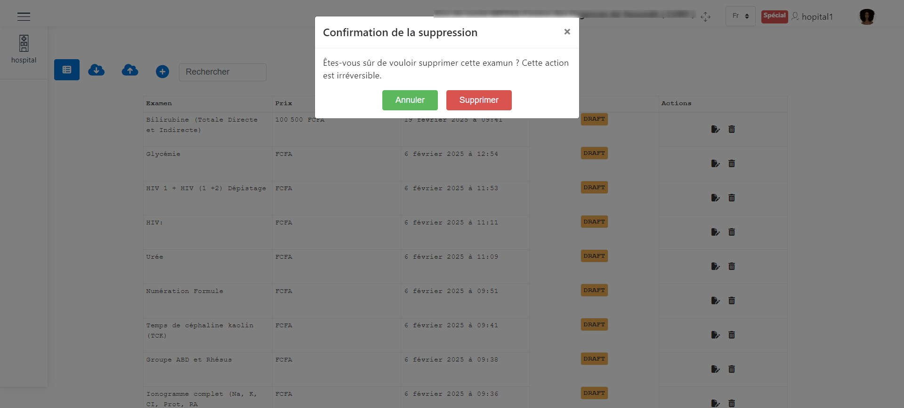
.. centered:: Delete an Examination.

.. _refLesTraitements:

Treatments
----------

Click on **2** as shown in :ref:`the following image <refConfiguration>`  
to access the treatment configuration interface.

The image below shows the treatment configuration interface.  
The actions that can be performed here are:

* Adding a new treatment
* Updating treatment information
* Deleting a treatment

.. _refTraitement:

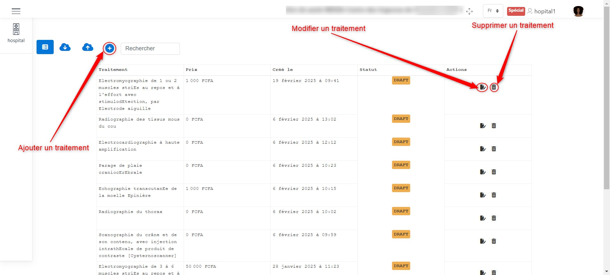
.. centered:: Treatment Configuration.

When clicking on **+** to add a treatment, as indicated :ref:`here <refTraitement>`, a window appears  
where you can enter the treatment details, such as its name and price.

Click the **Save** button to confirm the addition of the treatment.  
The image below illustrates this scenario.

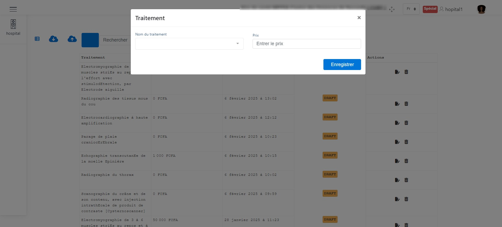
.. centered:: Add a Treatment.

To modify a treatment, click the edit button  
as shown in :ref:`the following image <refTraitement>`. A window will appear  
allowing you to modify the previously saved information.

Click the **Save** button to confirm the changes.  
The image below illustrates this scenario.

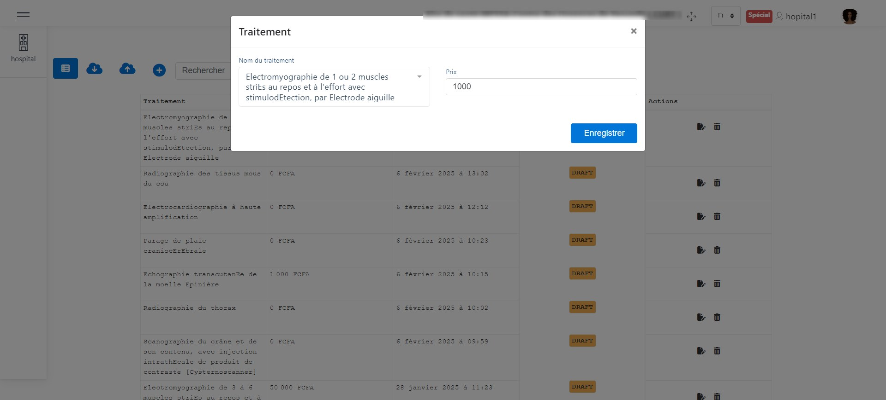
.. centered:: Edit a Treatment.

To delete a treatment, click the delete button  
as shown in :ref:`the following image <refTraitement>`. A window will appear  
allowing you to confirm the deletion of the treatment.

Click the **Delete** button to confirm the deletion  
or the **Cancel** button to cancel the operation.  
The image below illustrates this scenario.

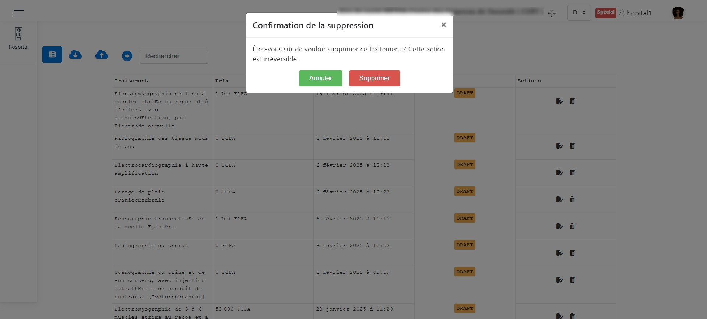
.. centered:: Delete a Treatment.

.. _refLesMedicaments:

Medications
-----------

Click on **3** as shown in :ref:`the following image <refConfiguration>`  
to access the medication configuration interface.

The image below shows the medication configuration interface.  
The actions that can be performed here are:

* Adding a new medication
* Updating medication information
* Deleting a medication

.. _refMedicament:

.. image:: ../Images/img-hopit/PrixMedicament.jpg
.. centered:: Medication Configuration.

When clicking on **+** to add a medication, as indicated :ref:`here <refMedicament>`, a window appears  
where you can enter the medication details, such as its name and price.

Click the **Save** button to confirm the addition of the medication.  
The image below illustrates this scenario.

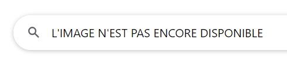
.. centered:: Add a Medication.

To modify a medication, click the edit button  
as shown in :ref:`the following image <refMedicament>`. A window will appear  
allowing you to modify the previously saved information.

Click the **Save** button to confirm the changes.  
The image below illustrates this scenario.

.. image:: ../Images/img-hopit/ModifierMedicament.jpg
.. centered:: Edit a Medication.

To delete a medication, click the delete button  
as shown in :ref:`the following image <refMedicament>`. A window will appear  
allowing you to confirm the deletion of the medication.

Click the **Delete** button to confirm the deletion  
or the **Cancel** button to cancel the operation.  
The image below illustrates this scenario.

.. image:: ../Images/img-hopit/SupprimerMedicament.jpg
.. centered:: Delete a Medication.

.. _refLesChambres:

Rooms
-----

Click on **4** as shown in :ref:`the following image <refConfiguration>`  
to access the room configuration interface.

The image below shows the room configuration interface.  
The actions that can be performed here are:

* Adding a new room
* Updating room information
* Deleting a room

.. _refChambre:

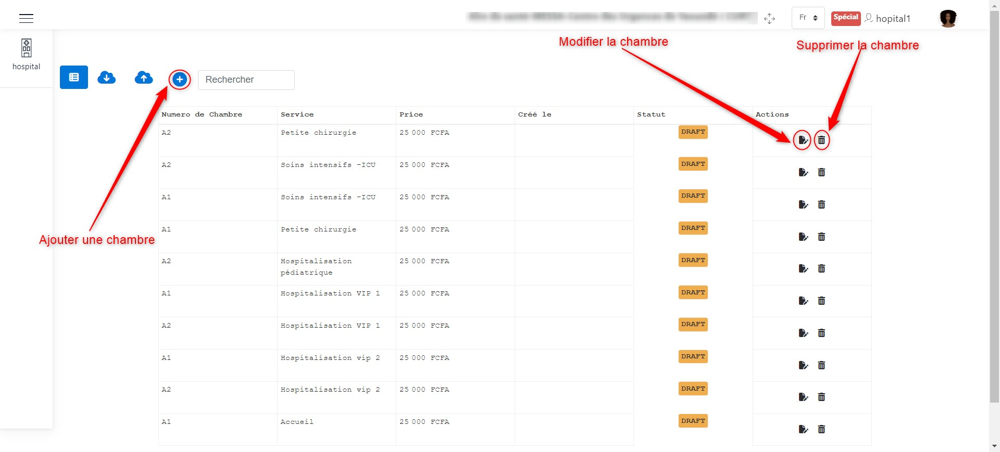
.. centered:: Room Configuration.

When clicking on **+** to add a room, as indicated :ref:`here <refChambre>`, a window appears  
where you can enter the room details, such as its number, the hospital department, and its price.

Click the **Save** button to confirm the addition of the room.  
The image below illustrates this scenario.

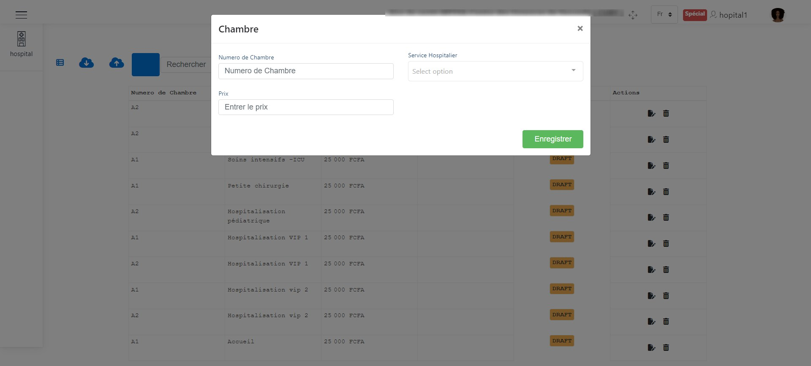
.. centered:: Add a Room.

To modify a room, click the edit button  
as shown in :ref:`the following image <refChambre>`. A window will appear  
allowing you to modify the previously saved information.

Click the **Save** button to confirm the changes.  
The image below illustrates this scenario.

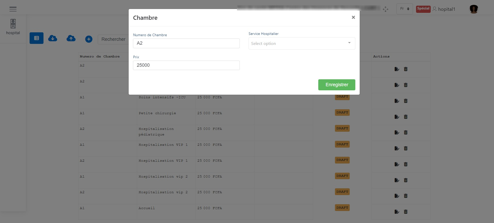
.. centered:: Edit a Room.

To delete a room, click the delete button  
as shown in :ref:`the following image <refChambre>`. A window will appear  
allowing you to confirm the deletion of the room.

Click the **Delete** button to confirm the deletion  
or the **Cancel** button to cancel the operation.  
The image below illustrates this scenario.

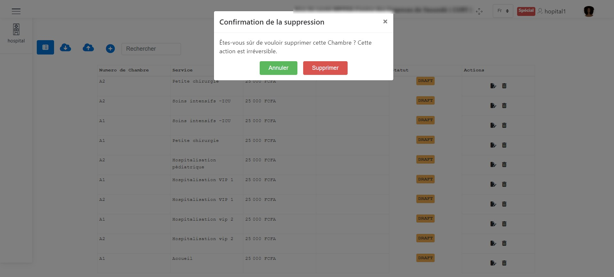
.. centered:: Delete a Room.

ICD CODE VIEWING
================

To view the list of ICD codes, please click on the **ICD Codes** button  
as shown in the image below.

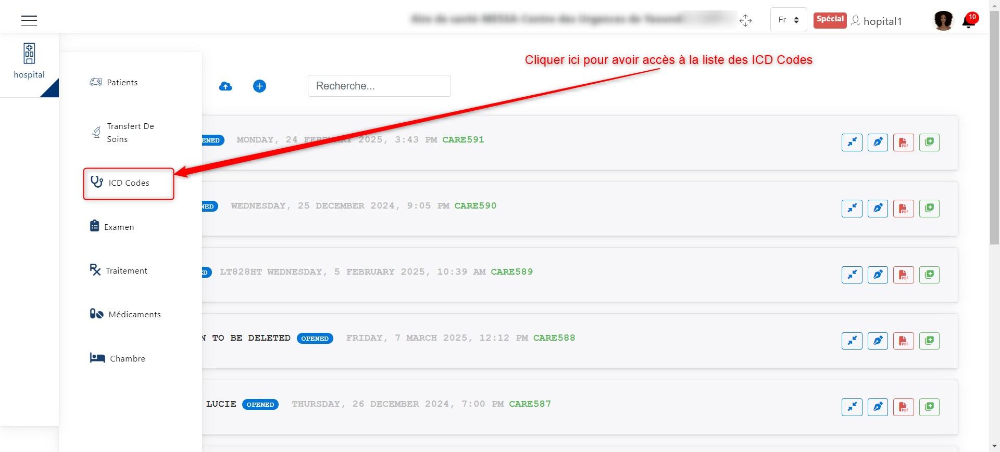
.. centered:: Access button to the ICD Codes list.

Once you have clicked on the **ICD Codes** button, you can view the list of ICD Codes.

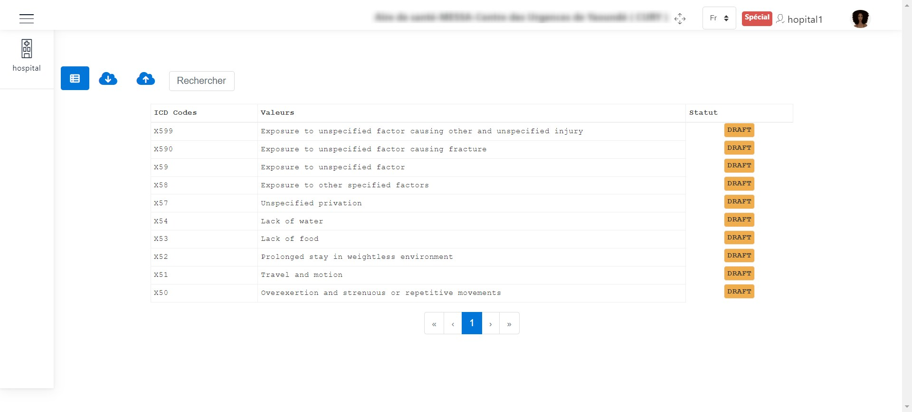
.. centered:: List of ICD Codes.
