Patient Medical Records Management
==================================
Right after logging into your account, you will have access to a home page where a list of existing medical records will be presented.

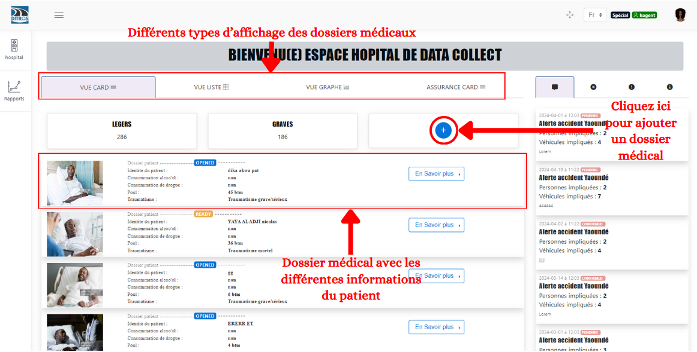
.. centered:: Hospital agent home page.

This interface allows you to add medical records to link victims to accidents reported by the collecting officer.

Add a Medical Record
====================
Here, when an accident victim arrives at the hospital, the hospital agent creates a medical record to enter various details about the accident and the patient. To do this, several information fields must be filled out.

Basic Information
-----------------
At this stage, the hospital agent enters all the patient's information.

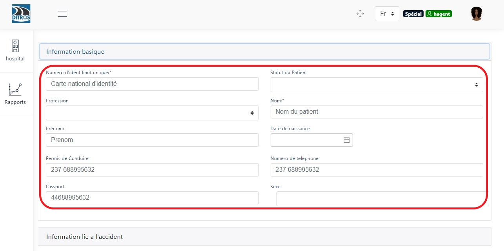
.. centered:: Basic Information.

Accident-related Information
----------------------------
At this stage, the hospital agent enters all the accident information.

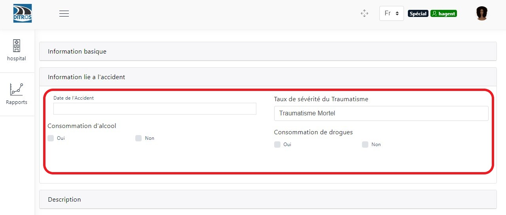
.. centered:: Accident-related Information.

Description
-----------
In this section, you must add a description of what you observe about the patient.

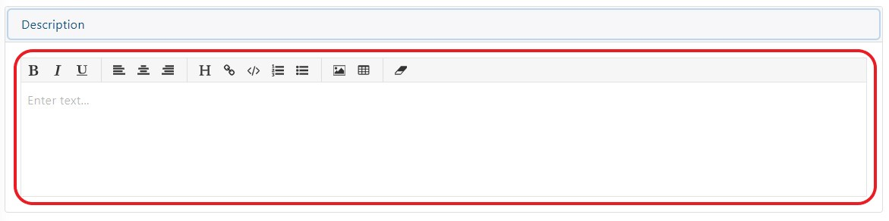
.. centered:: Description.

Medical Parameters
-------------------
Fill in the fields based on the observations made on the patient.

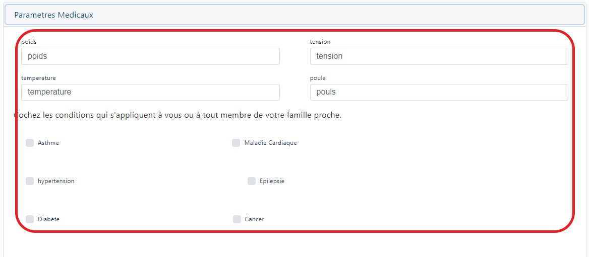
.. centered:: Medical Parameters.

Patient Contacts
----------------
Here, you are asked to enter the patient's contacts, which will be displayed in a table, and you can add as many contacts as the patient has.

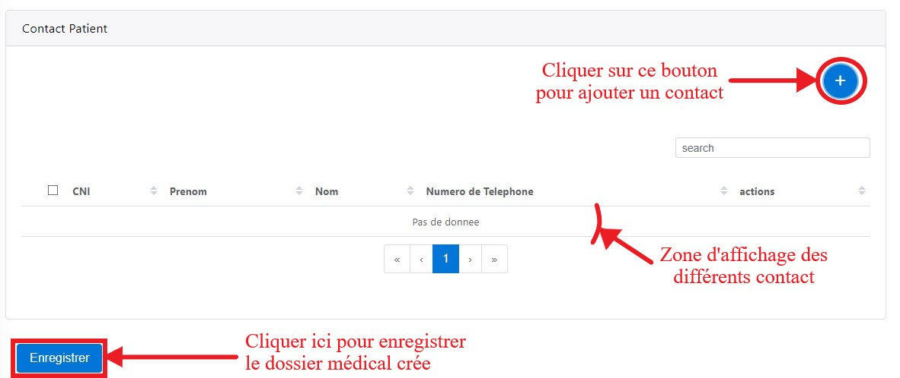
.. centered:: Patient Contacts.

When you click the button to add a contact, a dialog box will appear, and you must enter the contact details.

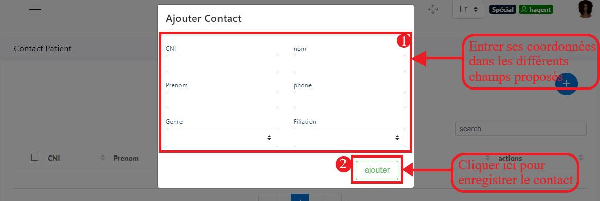
.. centered:: Add a New Contact.

Enrich the Medical Record
=========================
After adding the medical record, the record status changes to "OPENED." At this point, the hospital agent can only view, edit, or close the medical record if the patient's treatments have been completed.

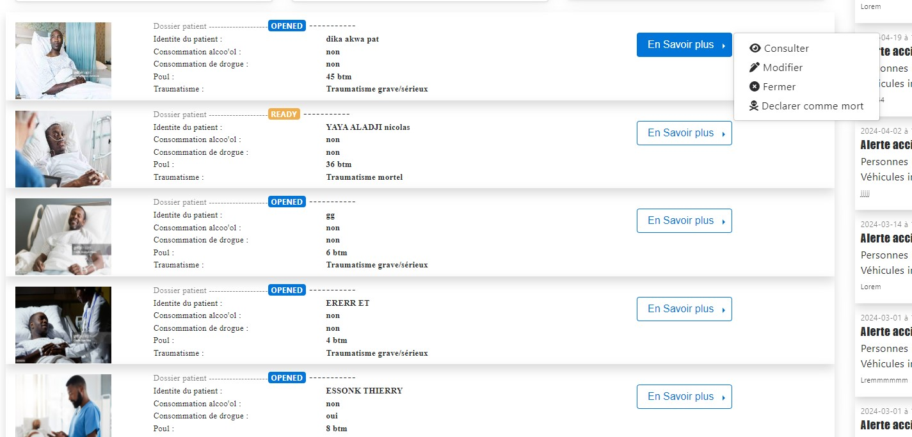
.. centered:: Learn More.

Edit the Medical Record
-----------------------
When you click "Edit," pre-filled form fields from the initial medical record entry are displayed with the previous values, which you can change as needed. After modifying these fields, click "Save" to save your changes.

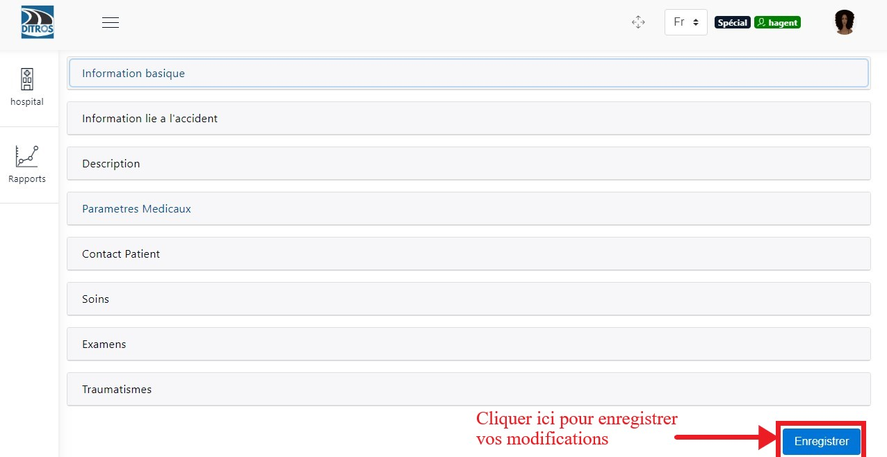
.. centered:: Editing a Medical Record.

Basic Information
~~~~~~~~~~~~~~~~~~~

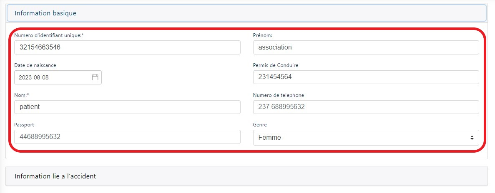
.. centered:: Editing Basic Information.

Accident-related Information
~~~~~~~~~~~~~~~~~~~~~~~~~~~~~
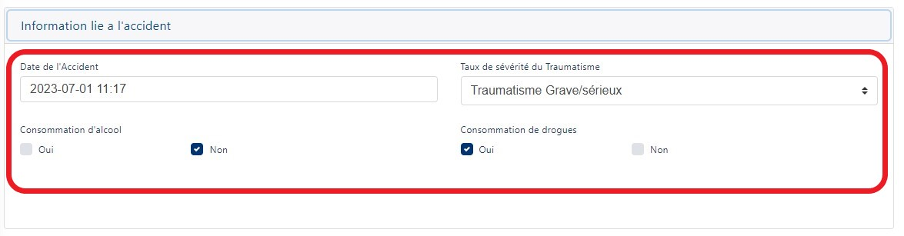
.. centered:: Editing Accident Information.

Description
~~~~~~~~~~~
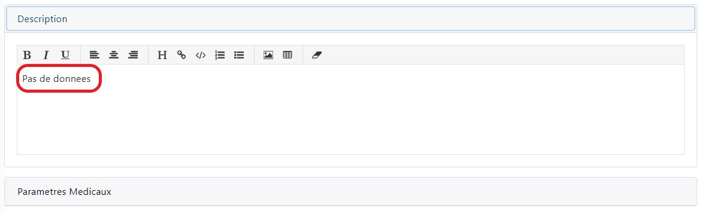
.. centered:: Editing the Description.

Medical Parameters
~~~~~~~~~~~~~~~~~~~
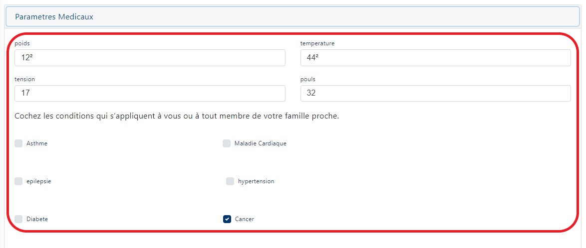
.. centered:: Editing Medical Parameters.

Patient Contacts
~~~~~~~~~~~~~~~~~~~
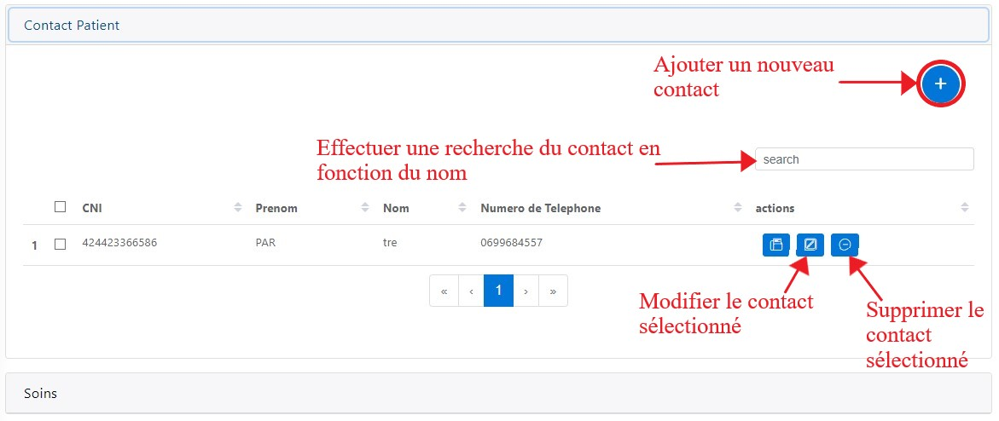
.. centered:: Editing Patient Contacts.

When you click the edit icon for a contact, a dialog box opens with the old values, and you must modify the fields you want and then click the "Edit" button. You will receive a confirmation message.

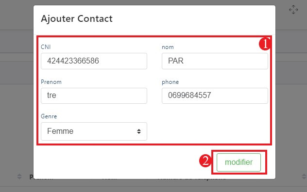
.. centered:: Editing a Patient's Contact.

Treatments
~~~~~~~~~~~
During the initial addition of a medical record, the treatment field was not added. Therefore, during enrichment, you provide the treatments the patient will need.

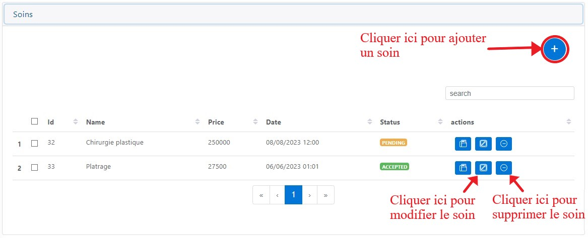
.. centered:: List of Treatments.

After adding a treatment, it will have the status "PENDING," but after the treatment is approved by insurance, the status will change to "ACCEPTED."

When you want to add a treatment, a dialog box is displayed where you must enter the date, time, and value of the treatments, then save the treatment by clicking the "Add" button.

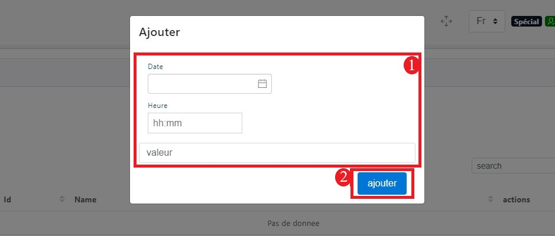
.. centered:: Add a Treatment.

Examinations
~~~~~~~~~~~~
During the initial addition of a medical record, the examination field was not added. Therefore, during enrichment, you provide the examinations the patient will need.

.. image:: ../Images/img-hopit/exam.jpg
.. centered:: List of Examinations.

After adding an examination, it will have the status "PENDING," but after the examination is approved by insurance, the status will change to "ACCEPTED."

When you want to add an examination, a dialog box is displayed where you must enter the date, time, and value of the examinations, then save the examination by clicking the "Add" button.

.. centered:: Add an Examination.

Traumas
~~~~~~~
During the initial addition of a medical record, the trauma field was not added. Therefore, during enrichment, you provide the traumas the patient has.

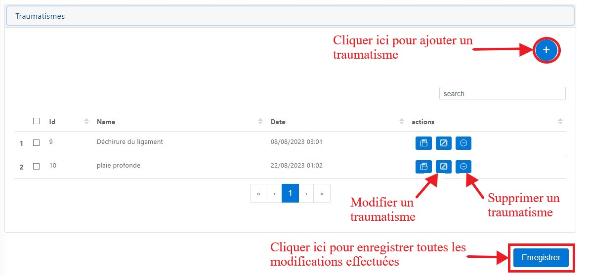
.. centered:: List of Examinations.

When you want to add a trauma, a dialog box is displayed where you must enter the date, time, and value of the treatments, then save the trauma by clicking the "Add" button.

.. centered:: Add a Trauma.

Close the Medical Record
========================
When you click "Learn More" on the medical record from the home page, you can decide to close the medical record if all treatment fees have been paid. When you decide to close the medical record, a confirmation dialog box appears. To confirm the closure, click "OK"; to cancel, click "Cancel." After closing the record, its status changes to "CLOSED." In this state, the hospital agent can only review and print the invoice for the record by clicking on "Learn More."

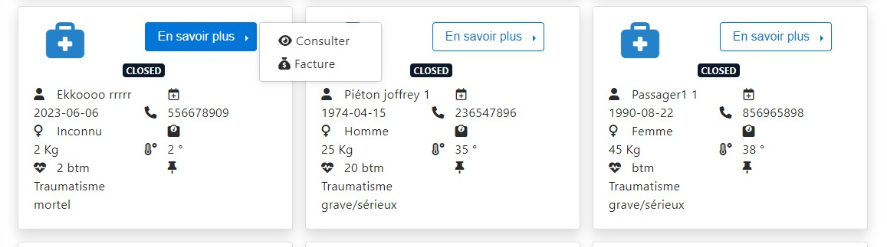
.. centered:: Closed Medical Records.

When you click "Invoice," to print the invoice, click "Print."

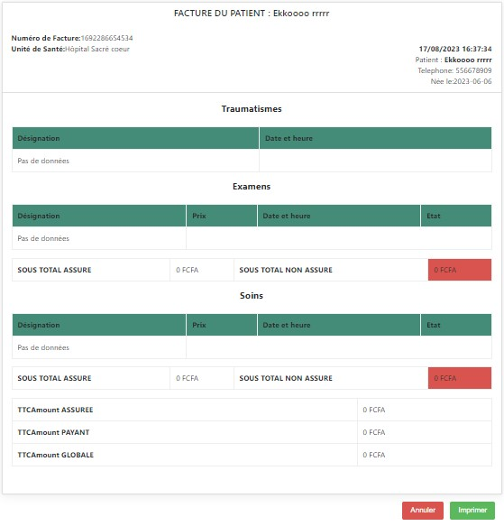
.. centered:: Invoices for a Closed Medical Record.

List of Treatments
==================
To access the list of treatments, click on the "Hospital" tab, then on the "Treatments" tab.

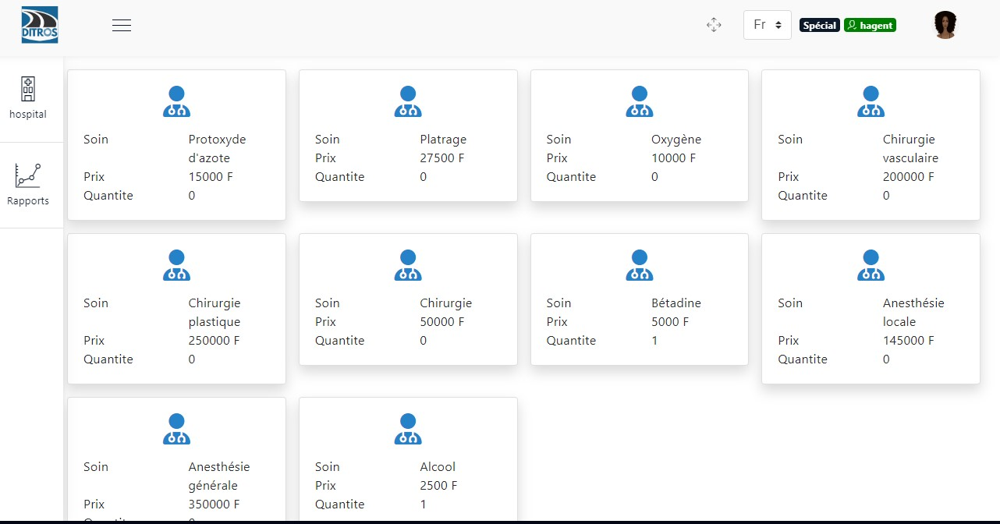
.. centered:: List of All Available Treatments in the Center.

List of Examinations
====================
To access the list of examinations, click on the "Hospital" tab, then on the "Examinations" tab.

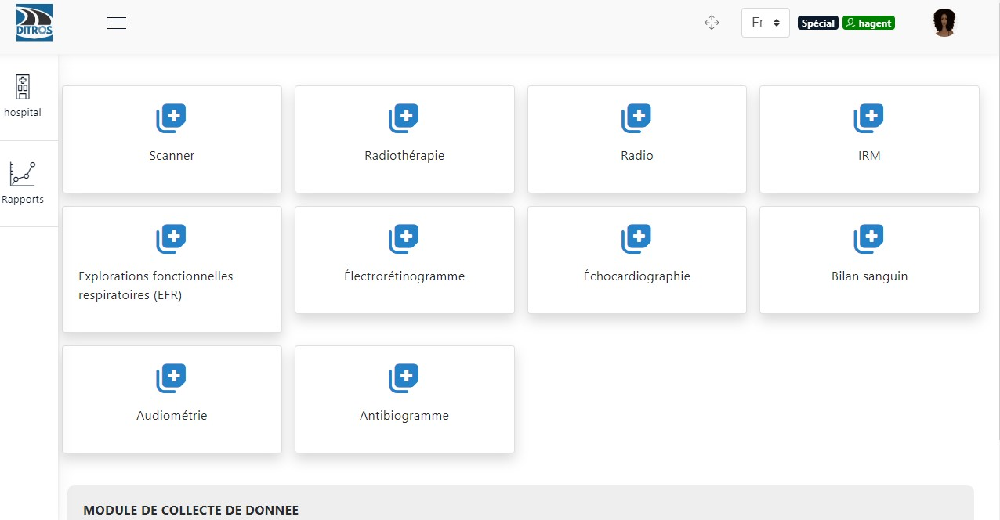
.. centered:: List of All Examinations.

List of Traumas
===============
To access the list of traumas, click on the "Hospital" tab, then on the "Traumas" tab.

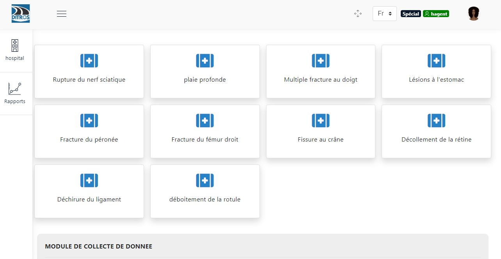
.. centered:: List of All Traumas.
