Patient Medical Records Management
==================================
Right after logging into your account, you will have access to a home page where the list of existing medical records is displayed.

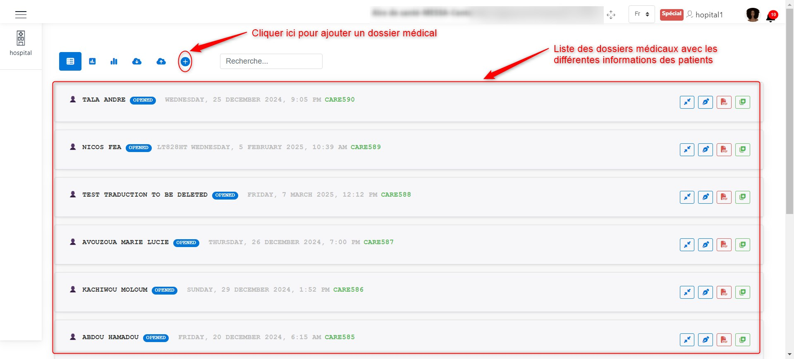
.. centered:: Hospital agent home page.

.. _refProcedureAddMedicalRecord:

Adding a Medical Record
=======================

Click on **+** to access the interface that allows you to add medical records.
These medical records help manage the patient's hospitalization, their care, 
and ensure the connection of accident victims to the accidents declared by the collection agent.
Here, when an accident victim arrives at the hospital, 
the hospital agent creates a medical record, then fills in various information about the accident and the patient. 
To do this, several information fields must be completed.

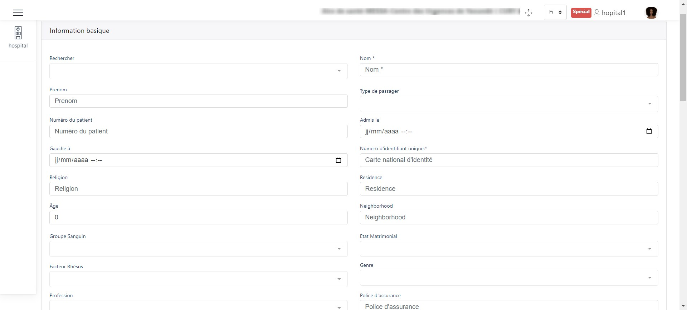
.. centered:: Basic information.

As we can see, the information to be completed includes:

* Basic patient information
* Information related to the accident
* A description of the patient
* Medical parameters
* The patient's address

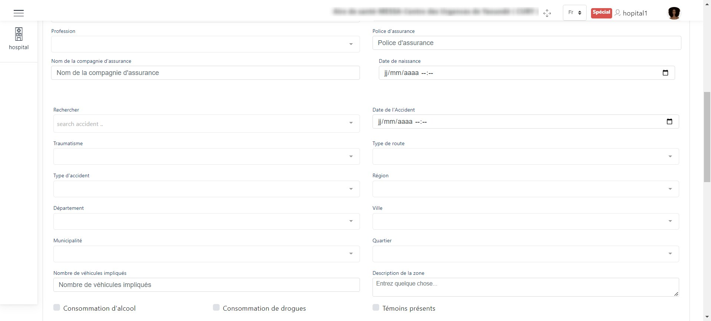
.. centered:: Other patient information.

Do not forget to enter the patient's contacts.
This is done by clicking the **+** button as shown in the following image:

**NB:** You can add as many contacts as the patient has.

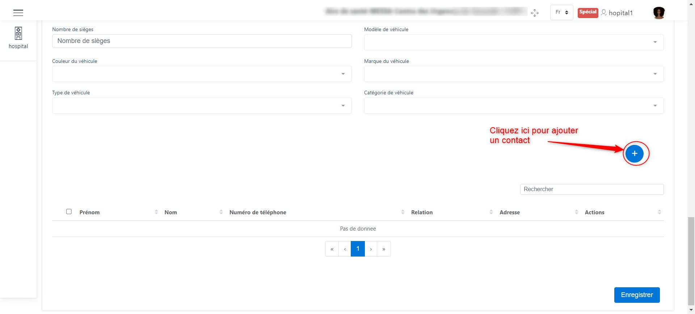
.. centered:: Add a contact.

When you click on the **+** button to add a contact, 
a dialog box will appear where you must enter their contact details 
and confirm the addition by clicking the **Add** button.

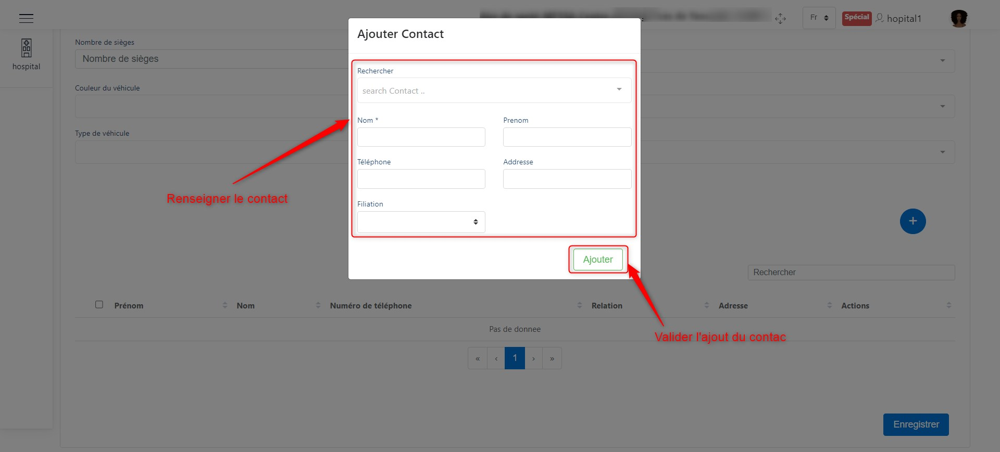
.. centered:: Add a new contact.

Finally, click the **Save** button to finalize the addition of the medical record.

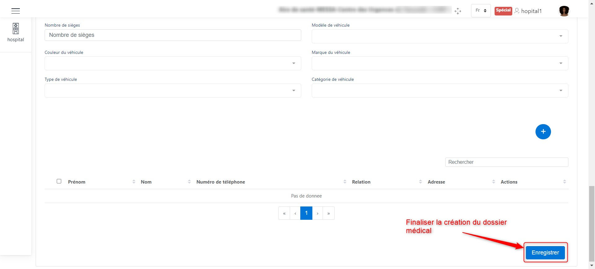
.. centered:: Finalize the medical record.

By clicking on the area represented by **1** in the image below, 
we can show or hide the medical record information.

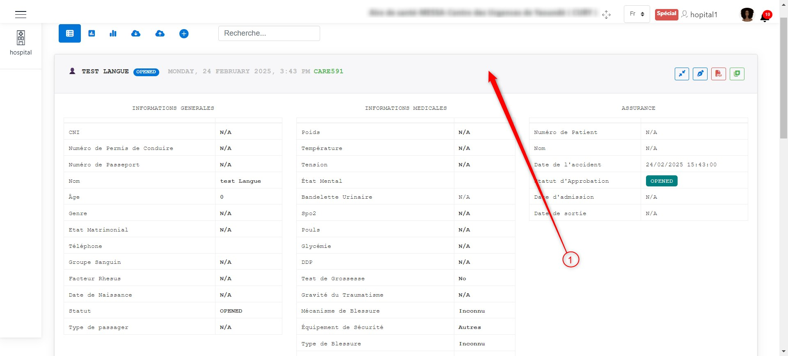
.. centered:: View the medical record.

Enriching the Medical Record
============================
After adding the medical record, its status changes to "OPENED," 
and at this point, the hospital agent can only view, modify, generate a PDF, or transfer the medical record.

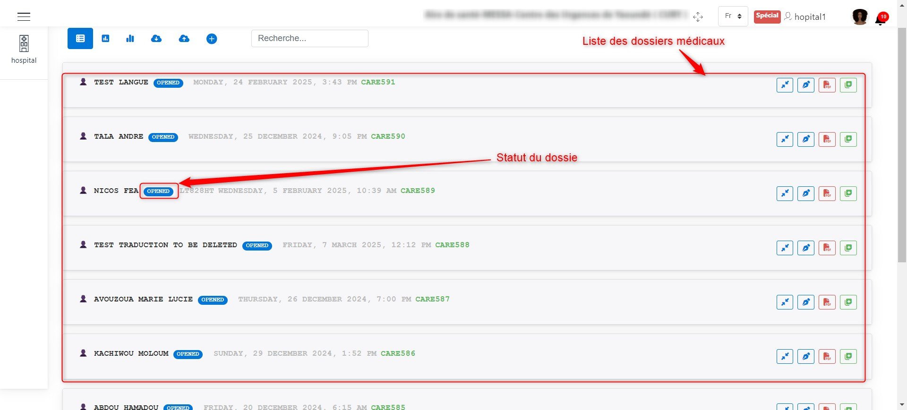
.. centered:: Medical Records & Statuses.

The image below presents the list of operations that can be performed on a medical record to enrich it.

.. _refMedicalRecordOperations:

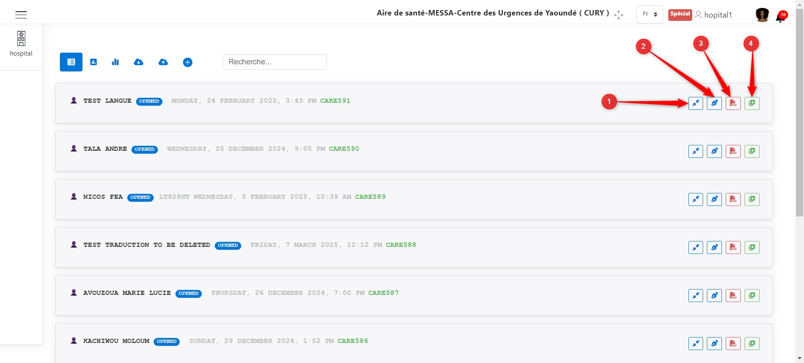
.. centered:: Operations on a medical record.

The numbers above illustrate the operations that can be performed on a medical record as follows:

**1** :ref:`Care transfer <TransferCare>`

**2** :ref:`Modify the medical record <ModifyMedicalRecord>`

**3** :ref:`View as PDF <ViewPDF>`

**4** :ref:`Add medical document <AddMedicalDocument>`

.. _TransferCare:

Care Transfer
-------------

Click on **1** as shown in :ref:`the following image <refMedicalRecordOperations>`, 
to initiate a care transfer.

A window appears where you need to enter the information about the hospital where the transfer 
will take place, the care status, the transfer method, and a description of the care status. 
Click the **Create** button to confirm the transfer.

The image below shows the window that appears after clicking the **1** button.

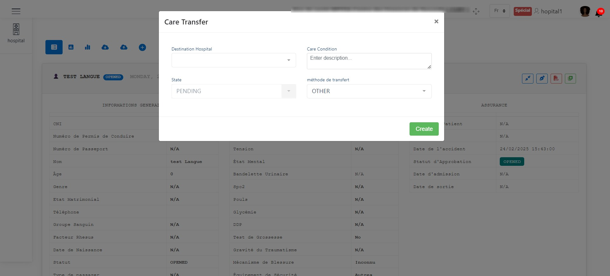
.. centered:: Care transfer.

.. _ModifyMedicalRecord:

Modify the Medical Record
-------------------------

Click on **2** as shown in :ref:`the following image <refMedicalRecordOperations>`, 
to modify the previously recorded information in the medical record. Modify 
the necessary details, then click the **Save** button at the bottom of the page.

The following image shows the interface for modifying medical record information, 
and the second image shows the button to save the modifications.

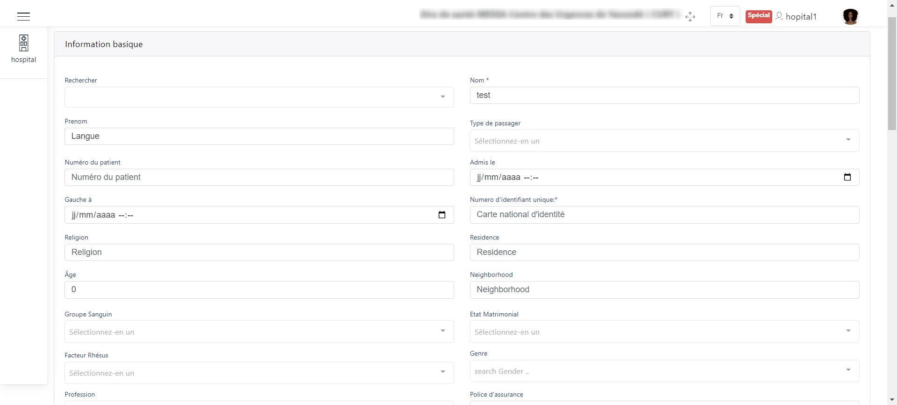
.. centered:: Modify medical record information.

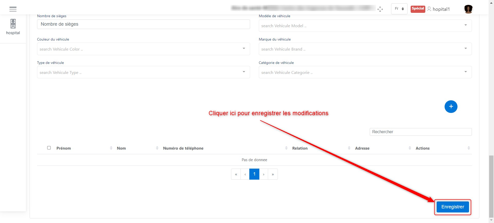
.. centered:: Confirm modifications to the medical record.

**NB:** If you encounter issues with the information entry process, please refer to 
:ref:`the procedure for adding a medical record <refProcedureAddMedicalRecord>`.

.. _ViewPDF:

View as PDF
-----------

Click on **3** as shown in :ref:`the following image <refMedicalRecordOperations>`, 
to view the medical record as a PDF.

The following image shows the medical record view in PDF format, with download and print options highlighted.

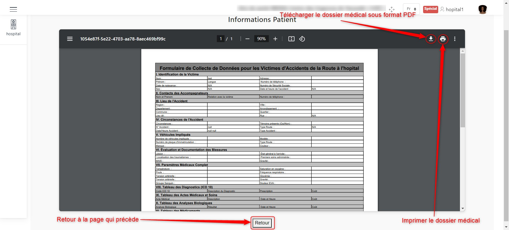
.. centered:: View medical record as PDF.

.. _AddMedicalDocument:

Add Medical Document
--------------------

Click on **4** as shown in :ref:`the following image <refMedicalRecordOperations>`, 
to add a medical document. The following image shows the interface that appears:

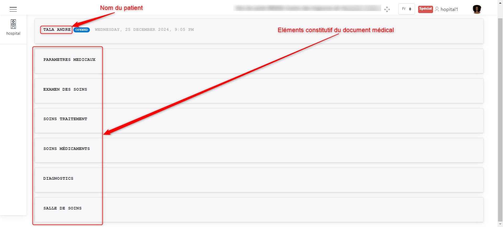
.. centered:: Medical document sections.

The medical document consists of:

* :ref:`Medical parameters <MedicalParameters>`
* :ref:`Care examinations <CareExaminations>`
* :ref:`Care treatments <CareTreatments>`
* :ref:`Care medications <CareMedications>`
* :ref:`Diagnoses <Diagnoses>`
* :ref:`Care rooms <CareRooms>`

However, we can always view patient information by clicking on their name.

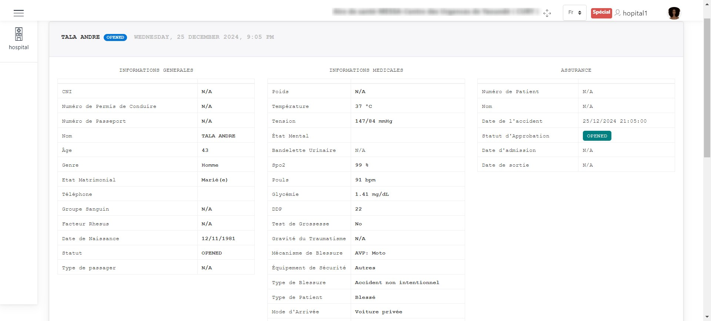
.. centered:: Patient information.

In the next sections, we will explain how to complete the elements of the medical record.

.. _MedicalParameters:

Medical Parameters
~~~~~~~~~~~~~~~~~~

The image below shows the form used to collect the patient's medical parameters.

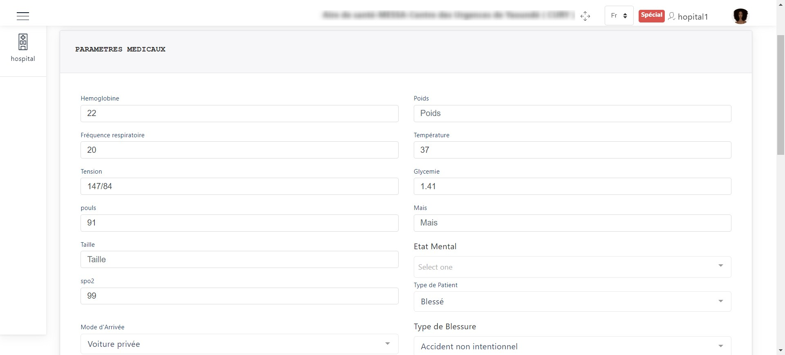
.. centered:: Medical parameters form.

Once the form is completed, click the **Save** button to store the entered parameters.

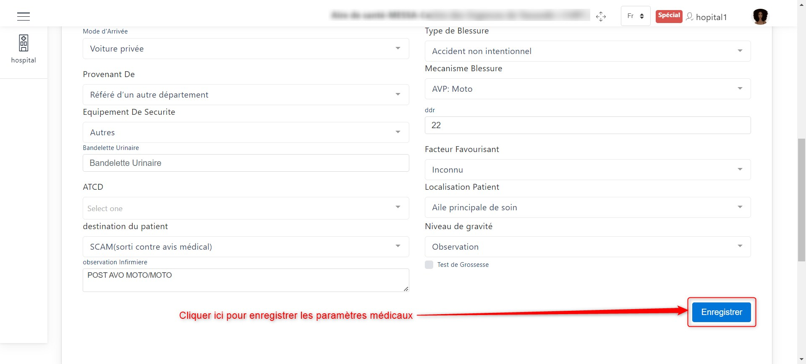
.. centered:: Save medical parameters.

.. _CareExaminations:

Care Examinations
~~~~~~~~~~~~~~~~~

The image below shows the interface for prescribing examinations for a patient.
The actions that can be performed here are:

* Prescribing a new examination
* Updating examination prescription details
* Deleting an examination prescription

.. _refCareExaminations:

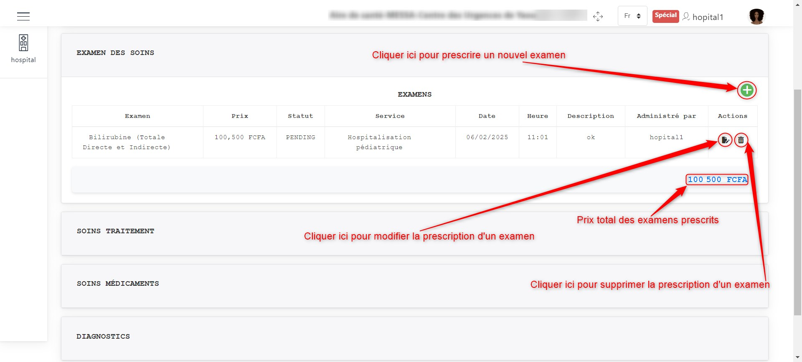
.. centered:: Care examination prescriptions.

When clicking on **+** to prescribe an examination as indicated :ref:`here <refCareExaminations>`, 
a window appears to enter the prescription details.

Finally, click the **Create** button to validate the prescription.
The image below illustrates this scenario.

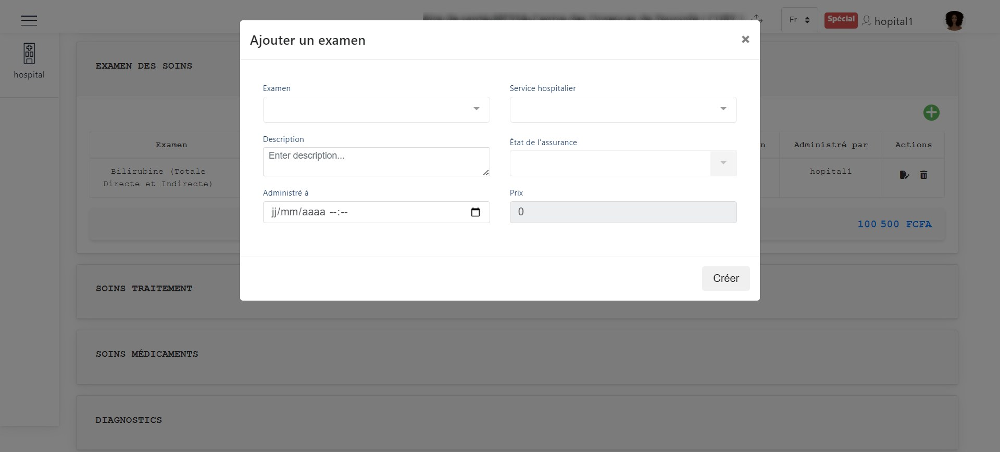
.. centered:: Add a prescription.

To modify a prescription, click the modification button as shown in 
:ref:`the following image <refCareExaminations>`. A window will appear to update the previous prescription information.

Click the **Save** button to confirm the modification.
The image below illustrates this scenario.

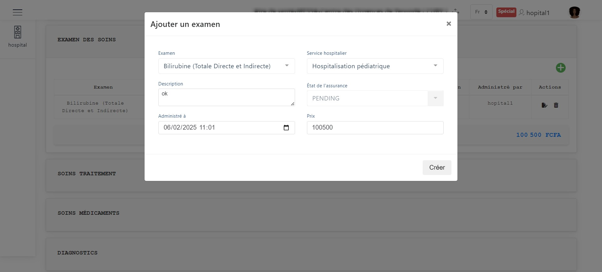
.. centered:: Modify a prescription.

To delete a prescription, click the delete button as shown in 
:ref:`the following image <refCareExaminations>`. A window will appear for confirmation.

Click **Delete** to confirm or **Cancel** to discard the deletion.
The image below illustrates this scenario.

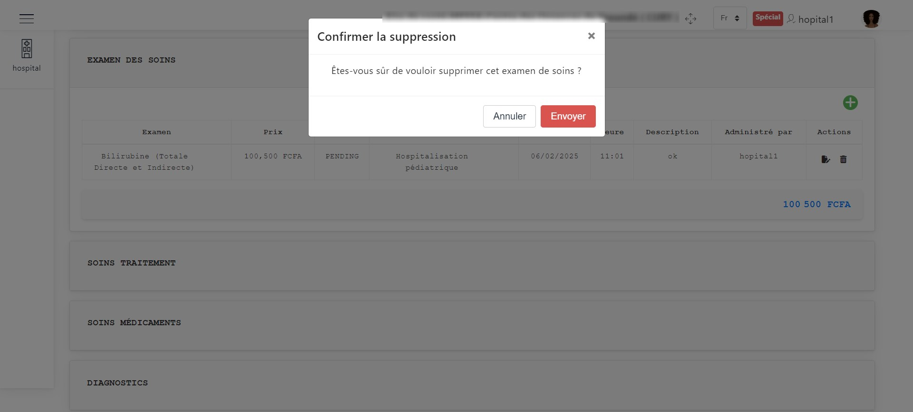
.. centered:: Delete a prescription.

.. _CareTreatments:

Care Treatments
~~~~~~~~~~~~~~~

The actions that can be performed here are:

* Prescribing a treatment
* Updating treatment prescription details
* Deleting a treatment prescription

These actions follow the same process as described in :ref:`the prescription above <refCareExaminations>`.

.. _CareMedications: 

Care Medications
~~~~~~~~~~~~~~~~

The actions that can be performed here are:

* Prescribing a new medication
* Updating medication prescription details
* Deleting a medication prescription

These actions follow the same process as described in :ref:`the prescription above <refCareExaminations>`.

.. _Diagnoses:

Diagnoses
~~~~~~~~~

The actions that can be performed here are:

* Prescribing a new diagnosis
* Updating diagnosis prescription details
* Deleting a diagnosis prescription

These actions follow the same process as described in :ref:`the prescription above <refCareExaminations>`.

.. _CareRooms:

Care Rooms
~~~~~~~~~~

The actions that can be performed here are:

* Assigning a patient to a care room
* Updating care room assignment details
* Deleting a care room assignment

These actions follow the same process as described in :ref:`the prescription above <refCareExaminations>`.

List of Transferred Patients in the Hospital
============================================

To view the list of transferred patients and admitted patients with an existing medical record, 
click the **Care Transfer** button as shown in the image below.

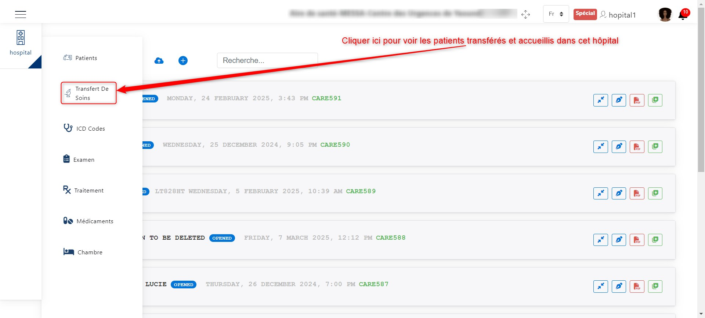
.. centered:: Button to access the list of transferred patients.

Once you click the **Care Transfer** button, you can see the list of transferred patients and admitted patients with a medical record.

.. _refTransferredPatientsList:

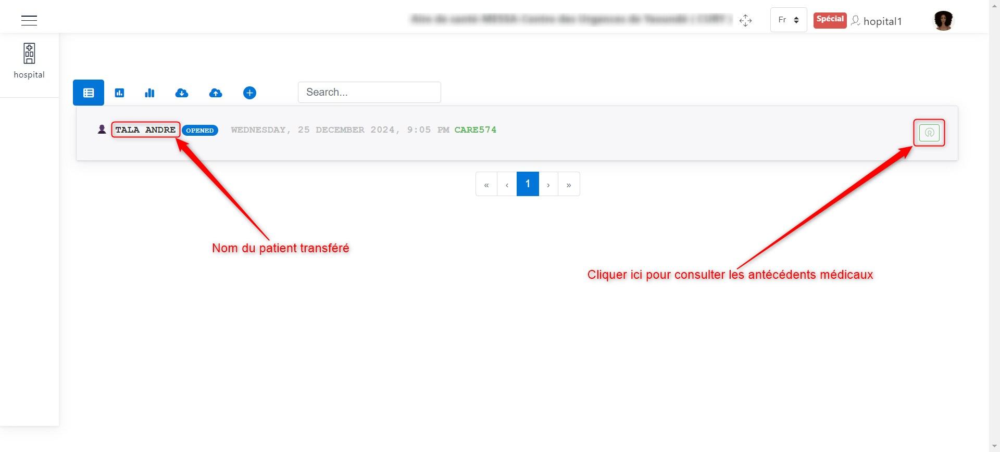
.. centered:: List of transferred patients.

On the interface above, you can:

* View patient information
* Check their medical history

To view the transferred patient's information, simply click on their name, as shown in 
:ref:`the following image <refTransferredPatientsList>`.

You will get an interface similar to the one below.

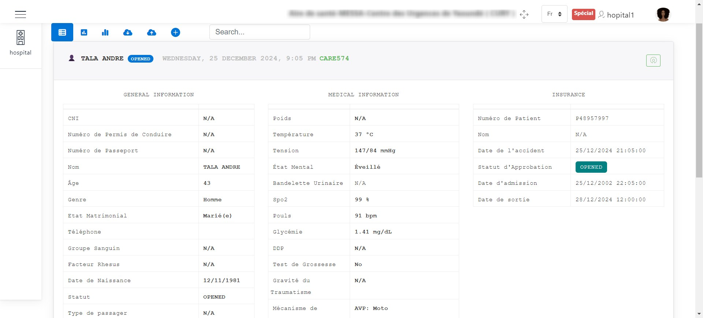
.. centered:: Transferred patient information.

To view the transferred patient's medical history, click the medical history button, 
as shown in :ref:`the following image <refTransferredPatientsList>`.

You will get an interface similar to the one below.

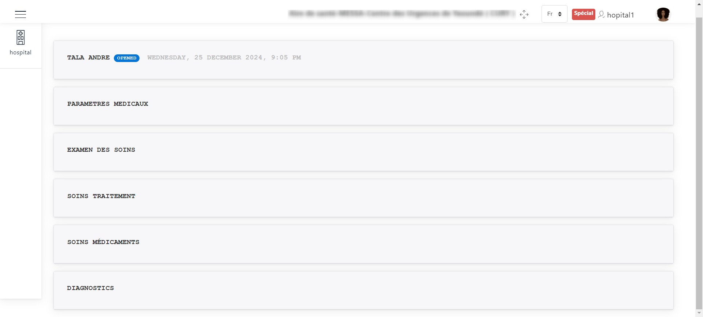
.. centered:: Transferred patient's medical history.

We can see that the medical document consists of:

* Medical parameters
* Care examinations
* Care treatments
* Care medications
* Diagnoses

**NB:** To view each section of the medical record, simply click on the desired section.

