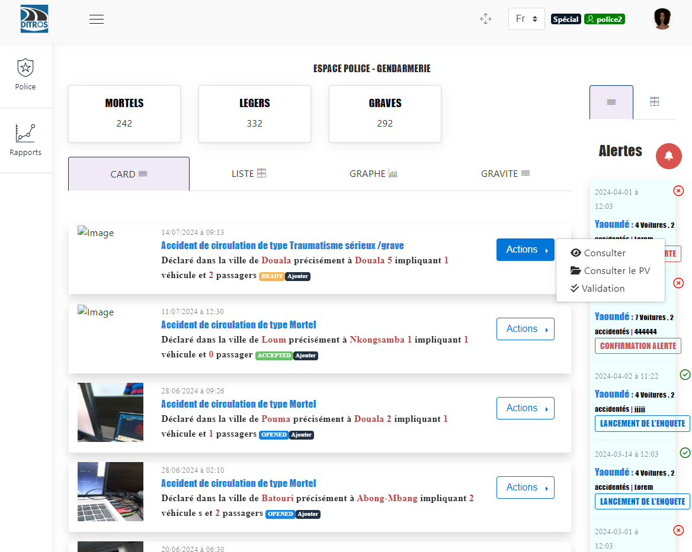
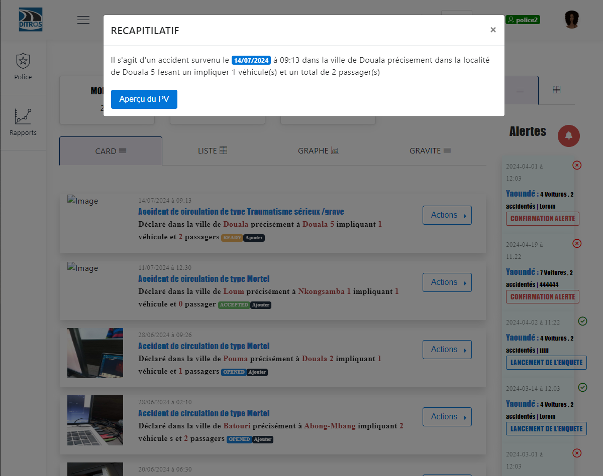
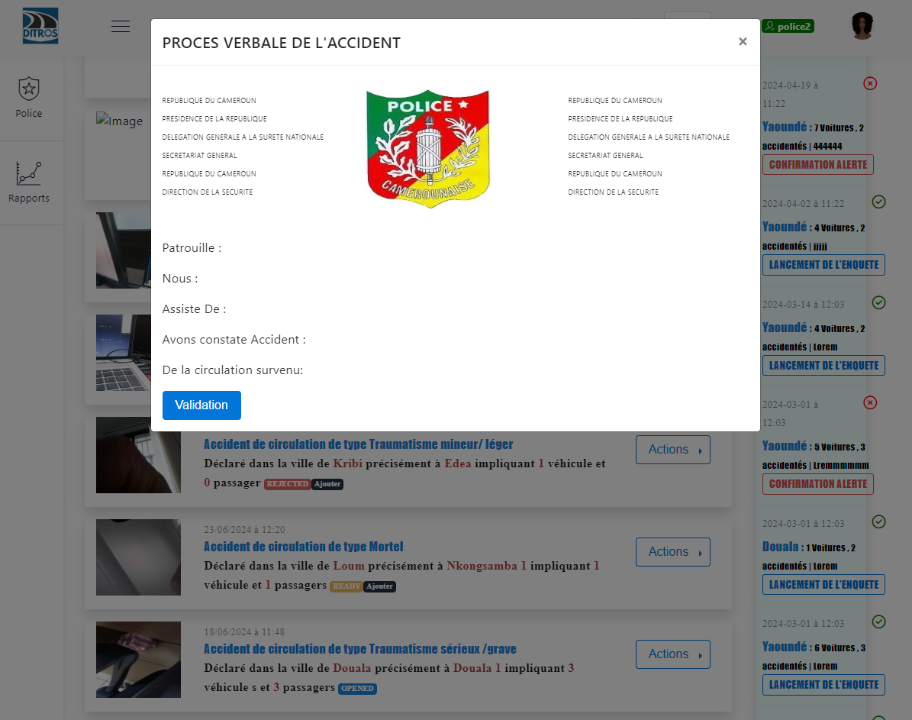
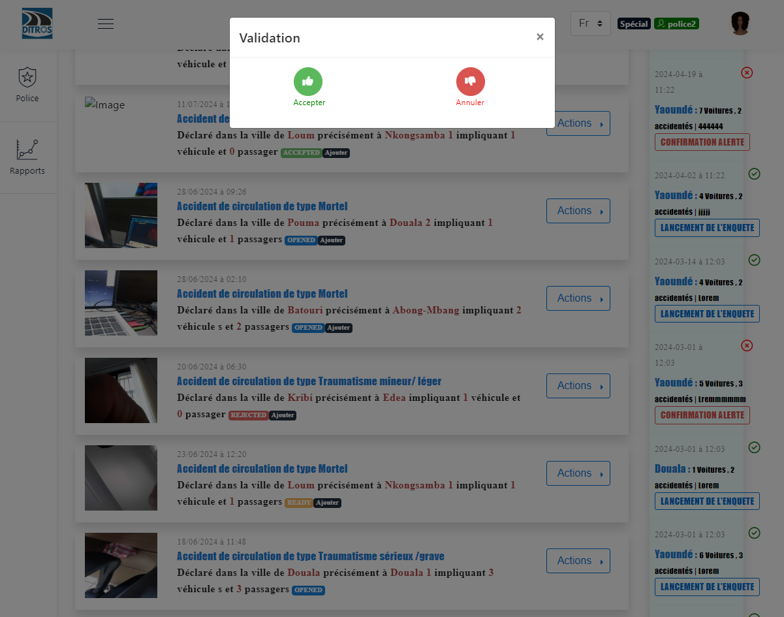
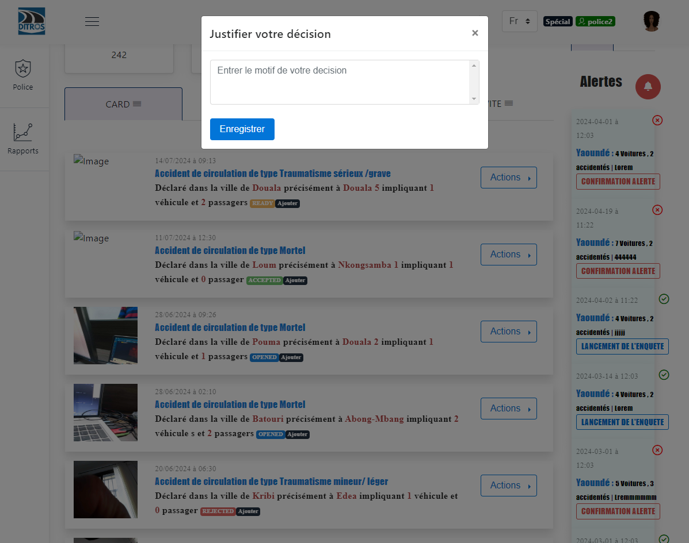
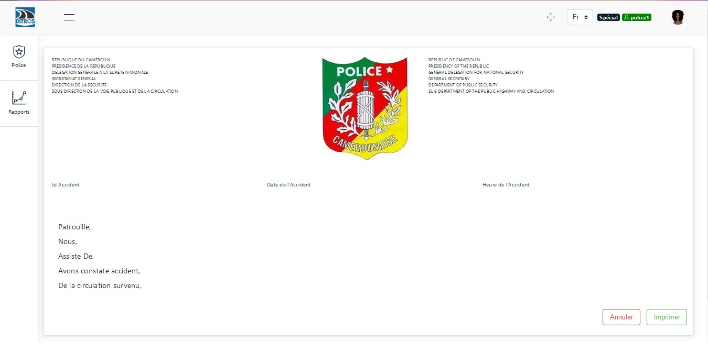
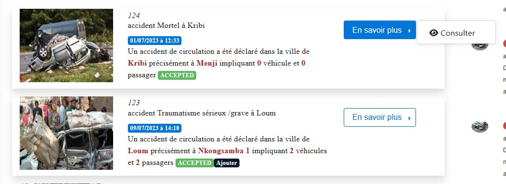
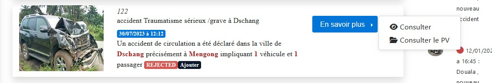
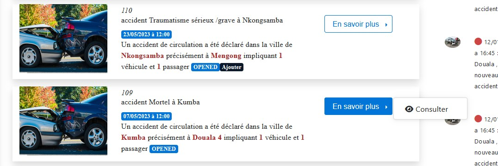
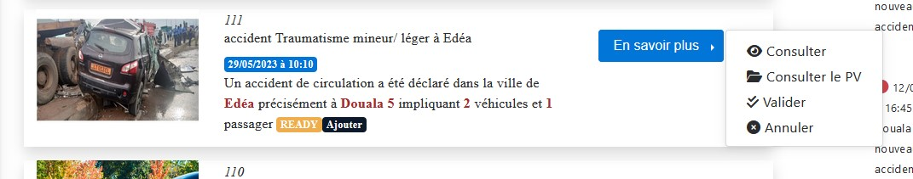

Validation of the Report
========================
**"NB:"** It is important to know that not every police officer has the authority to validate a report.

When you have the authorization, you will see on the declaration presentation interface some declarations with the status **"READY"**. To validate it, you must click on the **"Actions"** button and then click on **"Validation"** as follows:

.. centered:: Validate the Report

Then click on **"Report Preview"**

.. centered:: View Report Preview

Click on **"Validation"**

.. centered:: Report Preview

On the interface that will be displayed, you must make a decision based on the accident report. If it is necessary to reject the declaration, select **"Cancel"** and then provide a reason for the choice to ensure that the collecting officer is notified of the reason taken by their superior. The declaration status will then change to **"REJECTED"**. However, if the decision is to accept the declaration, you must select **"Accept"**, sign, optionally provide additional information, and confirm. The declaration status will change to **"ACCEPTED"**.

.. centered:: Validation Choice

.. centered:: Reason

Generate the Accident Report
============================
After completing this procedure, which results in a verified accident declaration, the authorized person is now able to generate a report for the accident for any necessary purposes.

.. centered:: Generate Report

You then have the option to print this report by clicking on **"Print"**.

Actions Performed by the Senior Collecting Officer Based on Declaration Status
===============================================================================
Whether the status is "ACCEPTED" or "ACCEPTED Add", the senior collecting officer can only review the declaration again.

.. centered:: Action of the Senior Collecting Officer at "ACCEPTED" Status

When the declaration is at the status "REJECTED" or "REJECTED Add", the actions of this officer will be to review the declaration and review the report.

.. centered:: Action of the Senior Collecting Officer at "REJECTED" Status

Whether the status is "OPENED" or "OPENED Add", the senior collecting officer can only review the declaration again.

.. centered:: Action of the Senior Collecting Officer at "OPENED" Status

When the collecting officer completes the preparation of their declaration, the declaration status changes to "READY". If a sketch has been added, it changes to "READY Add". At this point, the senior collecting officer can review the declaration, review the report, validate the declaration, and cancel or delete the declaration.

.. centered:: Action of the Senior Collecting Officer at "READY" Status
